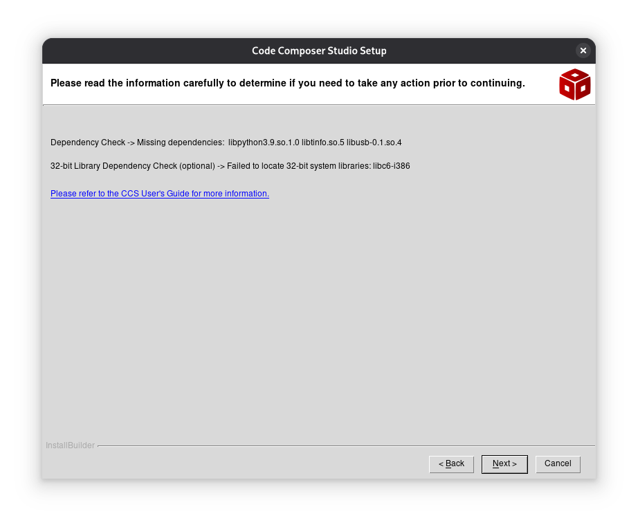
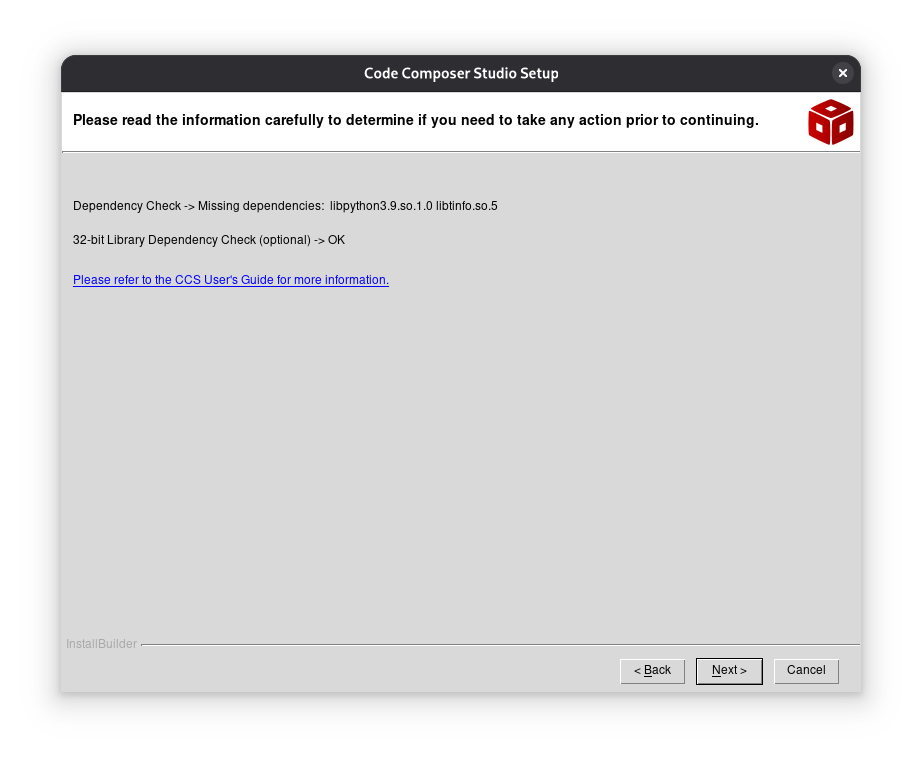
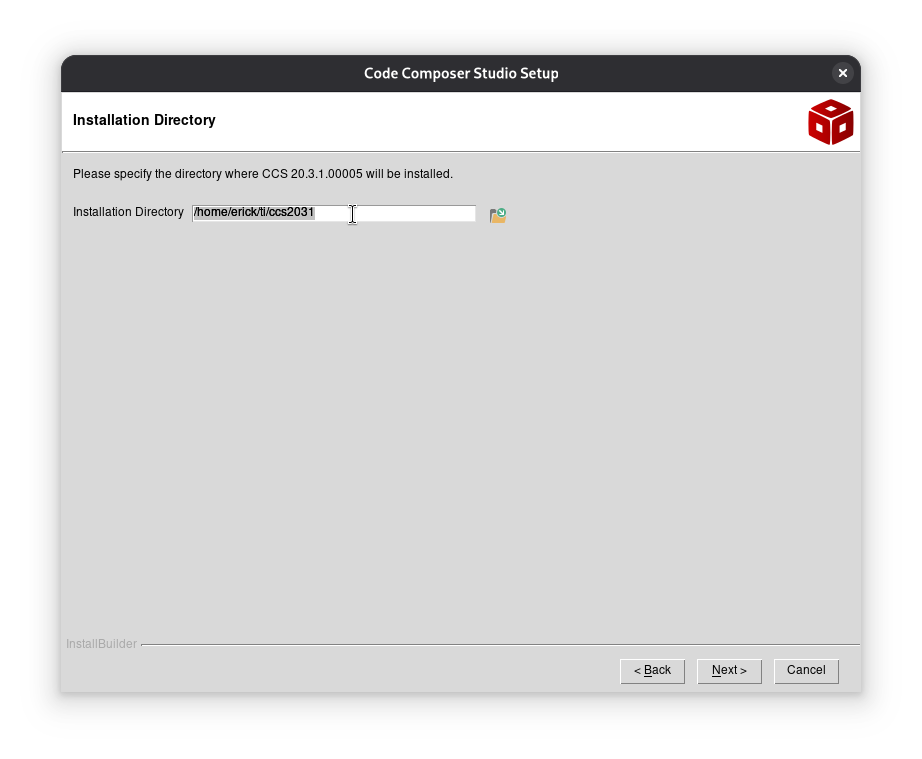
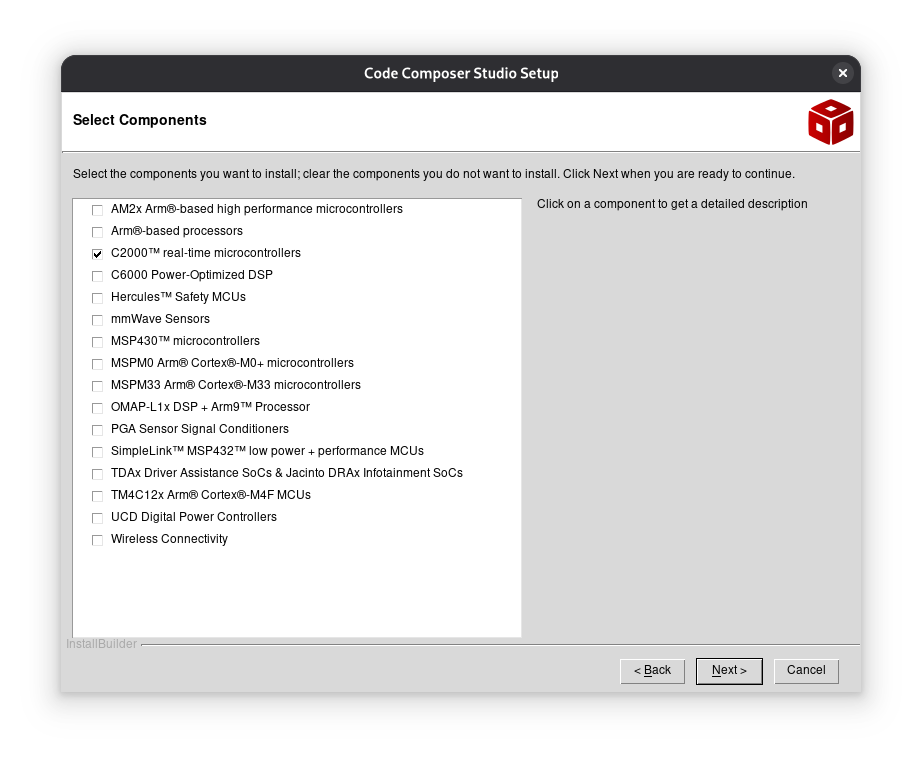
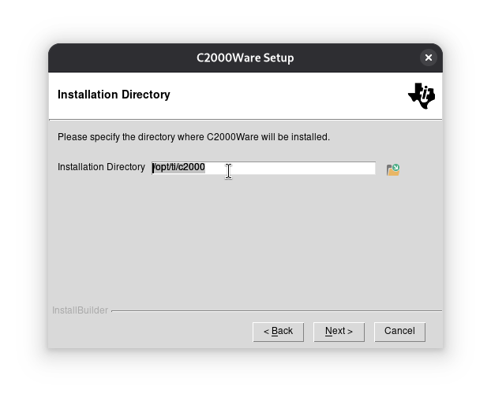
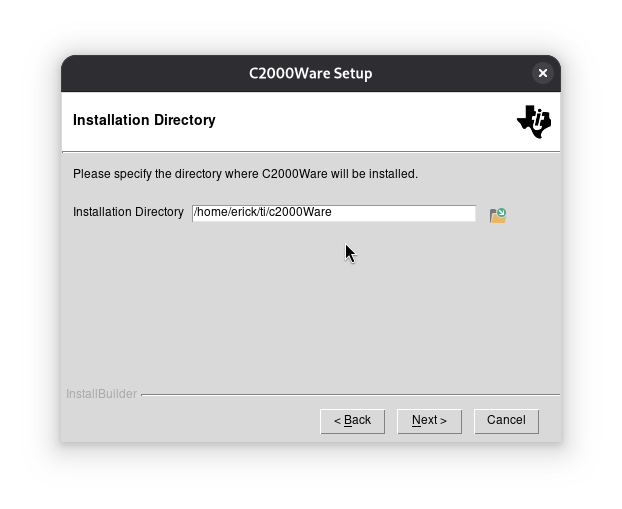

# 02 - Setting up tools

## Getting started
In this section we'll get started by setting up all the software required to program the board. The objective is to program our first "Hello World" (Blinking an on-board LED).

For this setup, we'll be using a Linux distribution (Debian)

## ⚙️ Preparing the OS
First, we are going to make sure our OS is up to date. We are going to update the packages repository and apply the latest updates. Lets head to the terminal and execute a sudo upgrade:

```bash
sudo apt update
sudo upgrade
```

## ⚙️ Verifying the hardware
We want to make sure that our OS can "see" the board when plugged in to the computer. We'll connect the board via the USB cable, and then we'll head to the terminal to execute the following command:
```bash
lsusb
```
On the terminal we should get a list with all the devices connected to the USB ports, as well as its device ID. When plugging the board, we should get something along the lines of:
```bash
Bus 001 Device 011: ID 0403:a6d0 Future Technology Devices International, Ltd Texas Instruments XDS100v2 JTAG / BeagleBone A3
```
This message means our computer is detecting the board when plugged in.

⚠️ Also, this message tells us that this specific revision of the board uses the `FTDI XDS100v2 JTAG` Debug Chip. This information is essential and it'll come handy when uploading our first project to the board.

## ⚙️ Granting USB permissions
On Linux by default the standard user doesn't have the required permission to write directly onto the USB hardware (dev/ttyUSBx). Without this permission we won't be able to flash or debug the board.
On Debian the group that manages the serial devices is `Dialout`

We have to make sure our user belongs to the `Dialout` group. This can be verified by running the following line on the console:
```bash
groups ${USER}
```
We should get all the groups our user belongs to:
```bash
erick@mi-debian:~$ groups ${USER}
erick : erick cdrom floppy sudo audio dip video plugdev users netdev scanner bluetooth lpadmin
```
To add our user to the `Dialout` group we'll run the following command:

```bash
sudo usermod -a -G dialout ${USER}
```
⚠️ This change has no immediate effect. In order to apply the changes, we must either sign out and sign in again, or restart our computer.

## ⚙️ Adding support for 32-bit architecture
Although we'll be using a 64-bit version of Debian, some (if not many) of the developement tools (including some low level drivers for TI debug tools), as well as some parts of CCS (we'll get to it on the next section), still depend on some 32-bit libraries. Enabling "Multi architecture" should avoid errors while installing CCS.
We'll run the following commands, which tell the system to use both 32-bit and 64-bit libraries:
```bash
sudo dpkg --add-architecture i386
sudo apt update
```

## ⚙️ Downloading and installing CCS (Code Composer Studio)
Code Composer Studio is the IDE for the Texas Instruments boards. Even though we'll be using Simulink to program our board, we still need CCS since it compiles the code (it works under the hood of Simulink).
First, we'll head to [Texas Instruments CCS download](ti.com/tool/download/CCSTUDIO) page. We'll download the file for our OS. Once the download finishes we'll extract the .ZIP file. On the terminal we'll access the directory of the extracted folder, and then proceed to install giving execution permissions. We'll do so by executing the following command:

```bash
chmod +x ccs_setup_20.3.1.00005.run 
```
And then we'll execute the installer:
```bash
./ccs_setup_20.3.1.00005.run
```
The graphical installer should launch. We'll follow the installation as suggested

### ⚠️ Important note
While installing, after accepting terms and conditions if we get the following notice, we must stop the installation process and take some additional steps, otherwise we won't be able to communicate with the C2000 board:



Even though CCS marks the dependency as "optional", it is actually neccesary to have the dependencies running so that we don't run into any further errors while trying to flash the board. Should we get this notice screen, we'll abort the installation process and run the following command:
```bash
 sudo apt install libc6-i386 libncurses6 libncursesw6 libusb-0.1-4
 ```
 This should install the missing dependencies. Once installed we'll execute the installer once again, and after accepting the terms and conditions now we should get something like this:



 We can dismiss the first missing dependency alert (we're using a newer version of `libpython` and `libtinfo`. We're getting this false positive because the installer is asking for the specific version of said dependencies. Don't worry, once installed, CCS should know that it does have the dependencies running, just on a newer version. It should handle it for ourselves). Once we cleared this alert, we can proceed with the installation.

 Onto the next screen we'll be asked to select the working directory for CCS. We'll leave it as default (something along the lines of `/home/user/ti/ccs2031`)




Once we selected the working directory, we'll be asked to select the components we want to install. By default, all of the components will be checked. In order to save space on our disk and have a faster installation, we'll just check `C2000 32-bit real-time Microcontrollers`:



The installer wizard will prompt us that the installation is ready to begin. We'll click on "Next and wait for CCS to install.

## ⚙️Installing hardware rules (udev)
Once CCS finished installing, we need one last step before we can start using it. We'll head to the route where CCS is installed (it should be on the `/home`directory, under the name of `ti`):
```bash
erick@mi-debian:~$ ls
Desktop  Documents  Downloads  Music  Pictures  Public  Templates  ti  Videos
```
We'll access the route `ti`, then run `ls` and finally change the directory to `ccsxxxx`:
```bash
erick@mi-debian:~$ cd ti
erick@mi-debian:~/ti$ ls
ccs2031
erick@mi-debian:~/ti$ cd ccs2031/
```
Inside this directory we should have another directory called `ccs`. We'll access this one as well and list its content:
```bash
erick@mi-debian:~/ti/ccs2031$ ls
 ccs  'CCS 20.3.1.desktop'
erick@mi-debian:~/ti/ccs2031$ cd ccs/
erick@mi-debian:~/ti/ccs2031/ccs$ ls
ccs_base         install_info     theia              uninstall_ccs.run
components.xlsx  install_logs     tirex4             uninstallers
doc              install_scripts  tools              utils
eclipse          scripting        uninstall_ccs.dat
```
We want to access the `install_scripts` directory to install the hardware rules. Once inside this directory, we should have a bash script named `install_drivers.sh`
We'll execute this script as sudo:
```bash
sudo ./install_drivers.sh
```
Once installed, CCS is ready to go!

## ⚙️Installing C2000 Ware
We installed CCS which is going to be our "workstation". Now, we need the "blueprints" that we'll work upon. This is where C2000 Ware takes action. It contains all the drivers and header files to actually build any sort of code (without this CCS is no other than a text editor).

We'll head to [Texas Instruments C2000 Ware download](https://www.ti.com/tool/download/C2000WARE/6.00.01.00) page and download the corresponding file for our OS.

⚠️ In order to download C2000Ware, TI requires us to register and set up an account using an email.

Once the file finishes downloading, we'll head to the directory where we saved our file and execute the installation file. First we'll give the file installation permissions with `chmod`:
```bash
chmod +x C2000Ware_6_00_01_00_setup.run
```
And then we'll run the executable:
```bash
./C2000Ware_6_00_01_00_setup.run
```
The graphic installer should start. Once we accept terms and conditions, the installer will ask us to select the installation path (it might pick the `/opt` directory by default):



We'll change the directory to the `ti` folder that was created while installing CCS so that we keep all the components under the same path. We'll pick the `/home/erick/ti/c2000Ware` as the designated path to install C2000Ware. 



Once the C2000Ware installation finishes, we're ready to run our [very first project!.](03-Training01.md)


