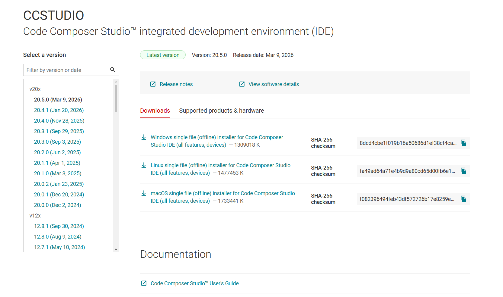
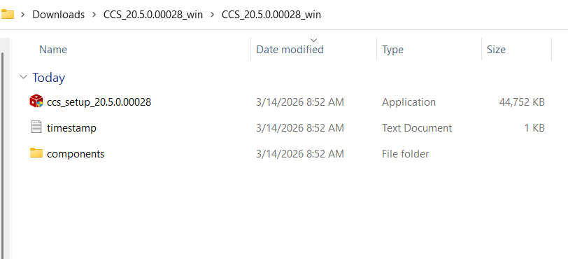
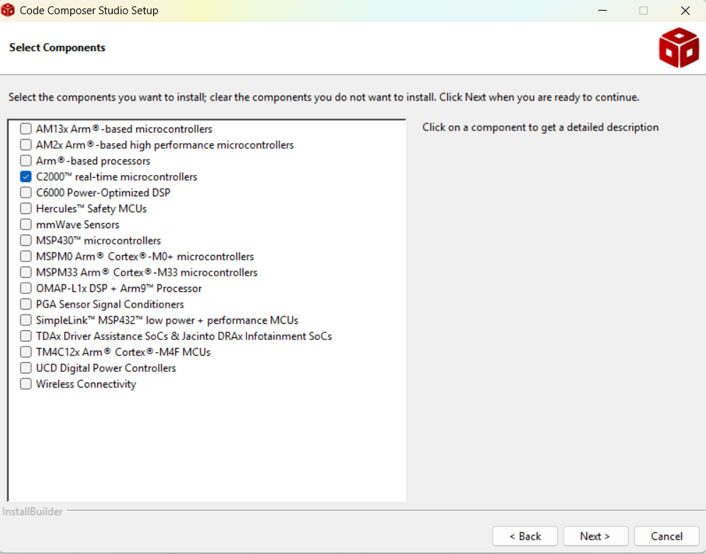
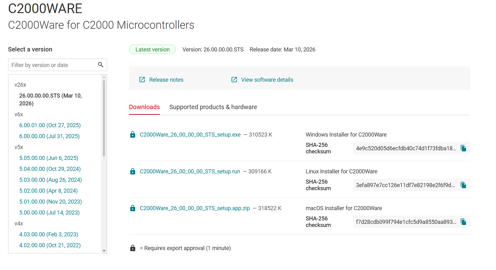
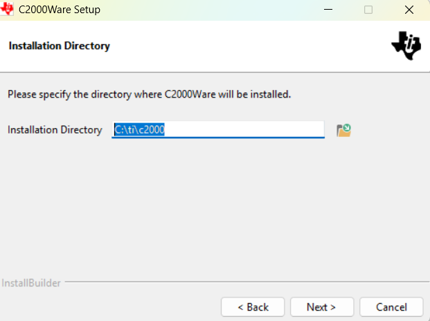
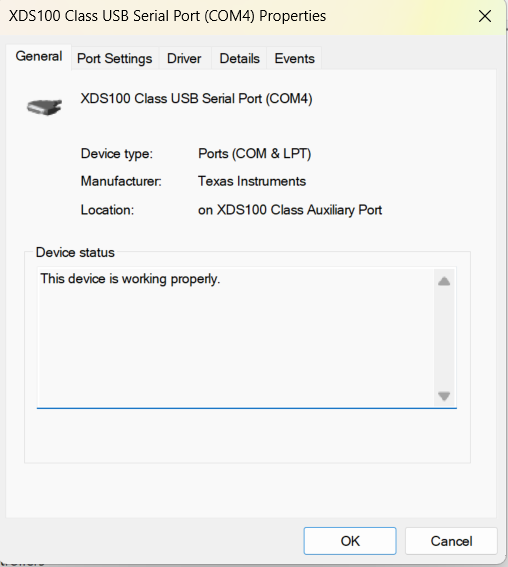

# 02 - Setting Up Tools

## Objective
This guide is aimed at downloading and installing all the necessary tools to program the board using Texas Instruments propietary software and Matlab/Simulink.
By the end of this guide the user should have the required software to start working and debugging code on to the development board.

## Getting started
First we need the foundation to develop our code and provide our computer with all the required files to establish communication with the board. We need to download and install two of the Texas Instruments propietary software: CCS (Code Composer Studio), and C2000Ware.
Code Composer Studio is the main IDE (Integrated Development Enviroment), whereas C2000Ware contains all the integrated libraries and drivers to communicate with the board.

## Downloading and installing Code Composer Studio (CCS)
Code Composer Studio is the IDE for the Texas Instruments boards. The actual "code" that will be uploaded to the board is to be designed on Simulink, but even though CCS is not used directly by the user, it is still necessary to upload the code (CCS works under the hood of Simulink)
First, head to [Texas Instruments CCS download](ti.com/tool/download/CCSTUDIO) page and download the Windows installer:

A .ZIP file is going to be downloaded. Extract the downloaded file, and open the `CCS_20.5.0.00028_win` folder. Run the `CCS Setup` executable file:

Proceed as instructed with the installation. A window will prompt the user to select which family of boards is to be used, select only C2000 Real time microcontrollers:

Wait until the installer prompt to Create a desktop shortcut and to Launch CCS. For now we will wait until we install C2000Ware before launching CCS.

## ⚙️Installing C2000 Ware
We installed CCS which is going to be our "workstation". Now, we need the "blueprints" that we'll work upon. This is where C2000 Ware takes action. It contains all the drivers and header files to actually build any sort of code (without this CCS is no other than a text editor).

Head to the [Texas Instruments C2000 Ware download](https://www.ti.com/tool/download/C2000WARE/) page and download the corresponding file for our OS:

⚠️ In order to download C2000Ware, TI requires us to register and set up an account using an email.

Once the file finishes downloading, we'll head to the directory where we saved our file and execute the installer:

We'll change the directory to the `ti` folder that was created while installing CCS so that we keep all the components under the same path.

## Plugging in the board
We now need to make sure that the computer detects the board. Plug the board via the Mini USB cable to the computer. Then, head to the Windows Control Panel and head to the Device Manager. The computer should be detecting both the board and the required driver:

Once the C2000Ware installation finishes and the computer is detecting the board, we're ready to run our [very first project!.](03-Blinky.md)

