# Training 01 - Blinky
Once CCS and C2000Ware are set up, the very first project is ready to be done!.
The purpose of this training is to get to know the CCS Workflow, as well as veryfying the set up was done correctly.

C2000Ware is included with some example projects. For this training the "Blinky" project will be used, which is a simple toggle of one of the onboard C2000 LED's.

## 🛠️ Inside CCS
First, execute CCS. Once CCS launches, the "Get started" page will be shown:

This window can be safely closed. Before uploading this first project to the board, a quick setup of CCS must be done.

### Setting up C2000Ware path on CCS
CCS must know where the C2000Ware path is located so that it can import all the necessary files to build the project. Head to the upper left corner to the `file` tab, then to `Preferences` -> `Code Composer Studio Settings`.

A new window will pop up. Go to the `General` tab, and then to the `products` sub-tab. On the `Product Discovery Path`. On the `Discovered Products` list C2000Ware shold be already listed:

Close this page by clicking the `"OK"` button.

By default, when CCS is launched the very first a folder is created on the `home` directory named `workspace_ccstheia`. This directory is called the "Workspace". Think of this as a "toolbox" where all the components of the projects are stored and a safe space where they can interact with each other.

## 🛠️ Setting up Blinky_01
On CCS on the left side bar there are some icons (Two paper sheets, a magnifying glass, a branch, a play button with a bug). Click on the two paper sheets to access the explorer tab. Here there are two lists, `Open Editors` and `WORKSPACE_CCSTHEIA`. Click on `WORKSPACE_CCSTHEIA` to expand the list (it should be empty at the moment):

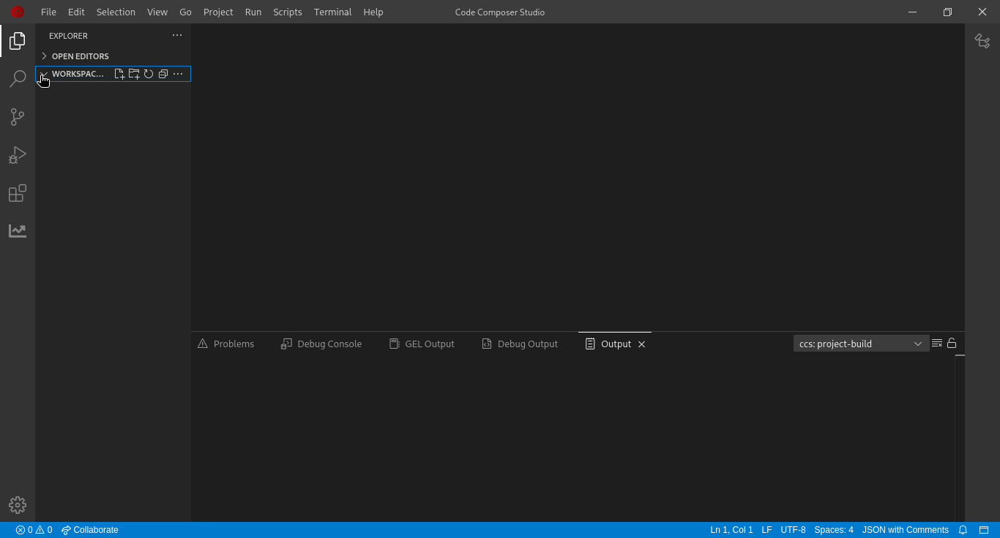

To import the `Blinky` project from C2000Ware to our workspace on CCS on the upper left corner click on `File`, and then on to `Import projects`:

On the following window select the directory from where the project is to be imported from. First, click on the  `"browse"` button:

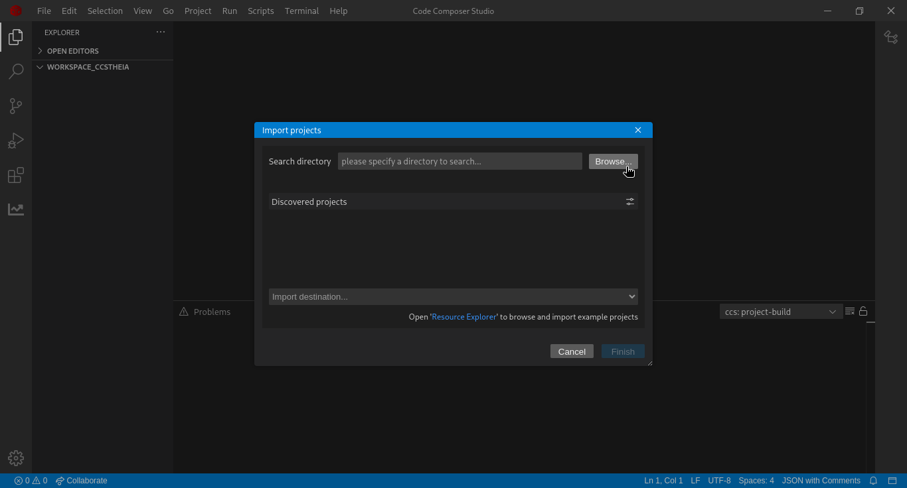

Browse to the `home` directory, then to the `ti` folder and then open up `c2000ware` -> `C2000Ware_6_00_01_00`. Inside this folder there must be another folder called `device_support`:

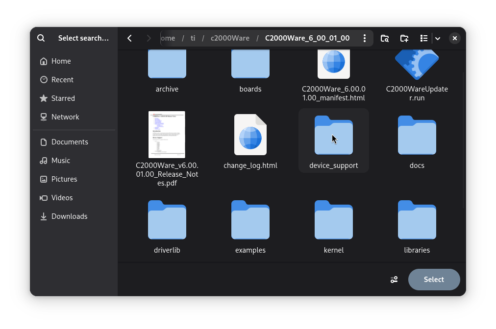

Access this folder and select the sub-folder correspondig to the target microcontroller (in this case the C2000 Launchpad belongs to the `F2387XD` family):

Upon openning this folder, there's an `examples` subfolder:

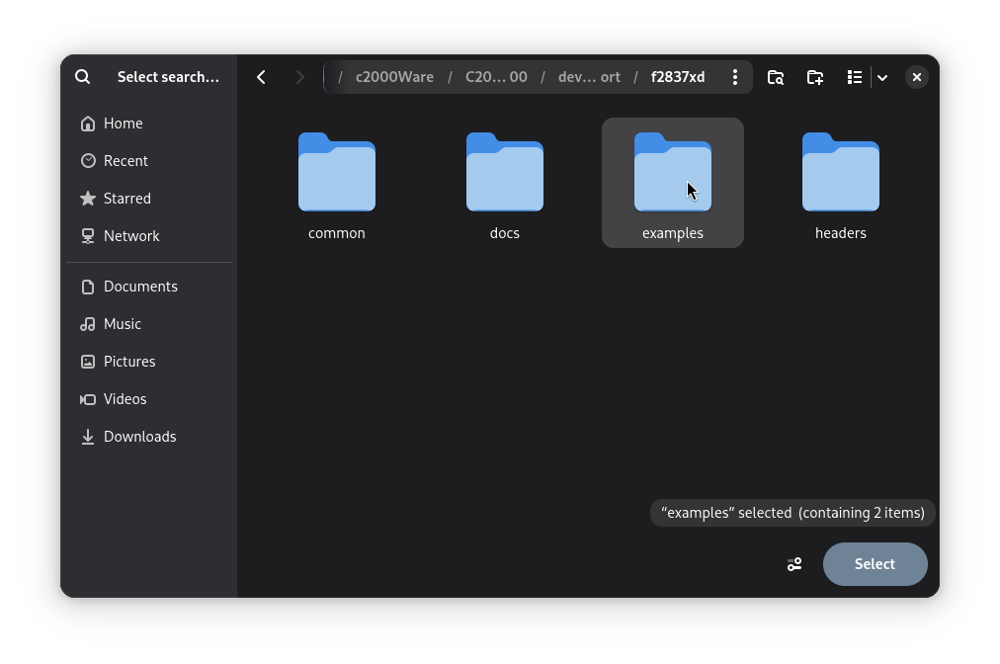

This folder contains both examples for single core programs (`cpu1`) and dual core programs (`dual`). This training uses the single core version of blinky:

Within this directory `cpu1` are located all the folders for all the single core examples projects. Select the `cpu1` directory to be browsed:

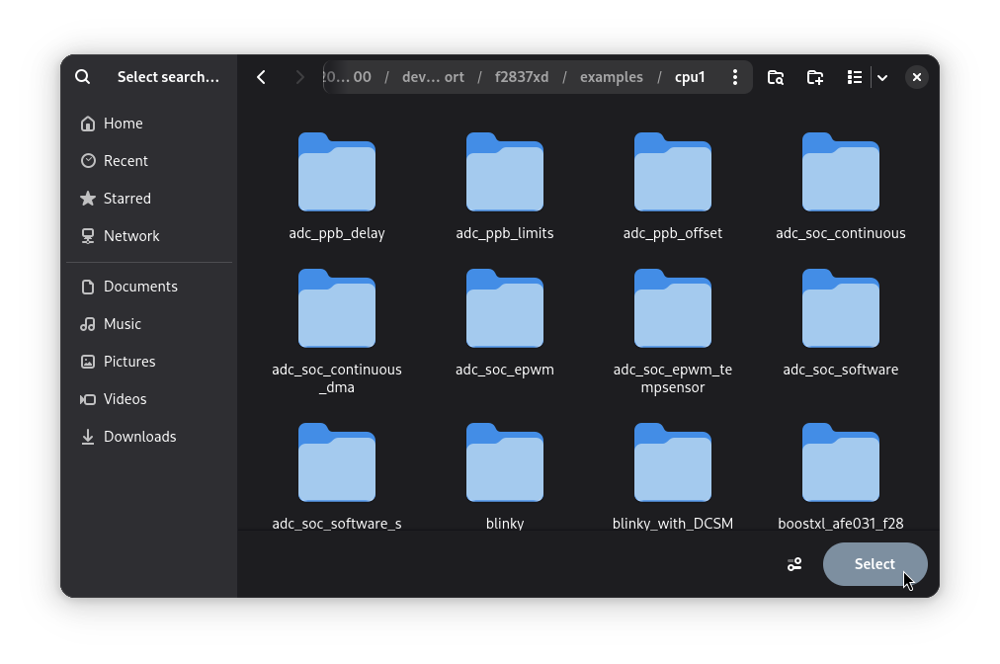

CCS should start importing all the available projects to the project import tool. Look for the `blinky_cpu01` project and select it. Also, on the collapsable list select the "Copy imported projects into" option:

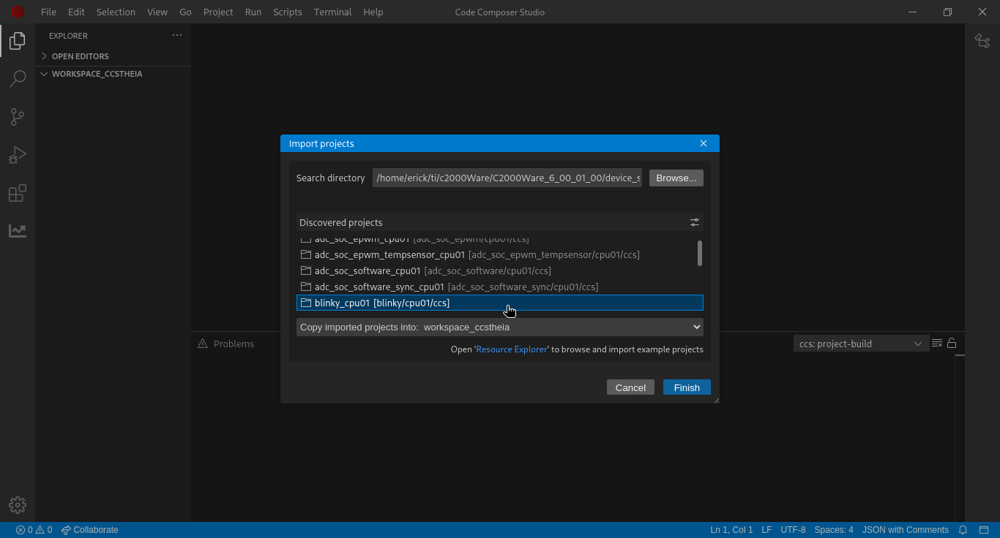

Once the project is done importing all the files related to the project are displayed on the CCS Explorer:

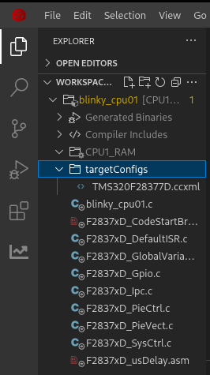

Now, left click on the project `blinky_cpu01`, and click on the `Properties` options`:

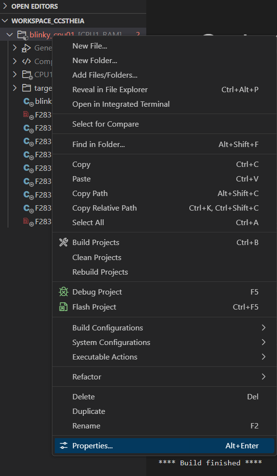

A new window will pop up. On the `General` tab set the options as following:

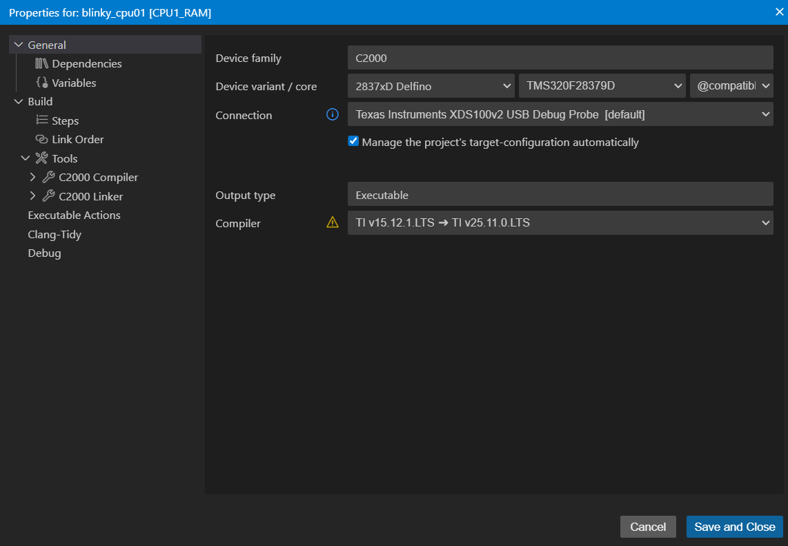

Head to the `C2000 Linker` tab, and click on `File Search Path`:

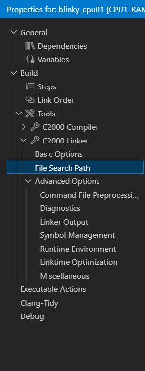

Select the `rts2800_fpu32.lib` file and click on the minus `-` icon to remove this file:

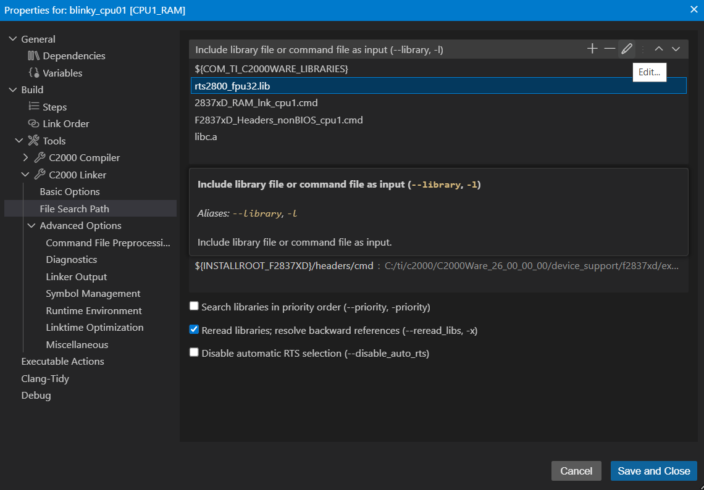

Click on `Save and Close`. Now, head back to the project explorer on the workspace tab. Expand the `targetConfigs` tab. On the displayed list,  left click on the `2387x_FLASH_lnk_cpu.cmd` file and select `Exclude From Build`:

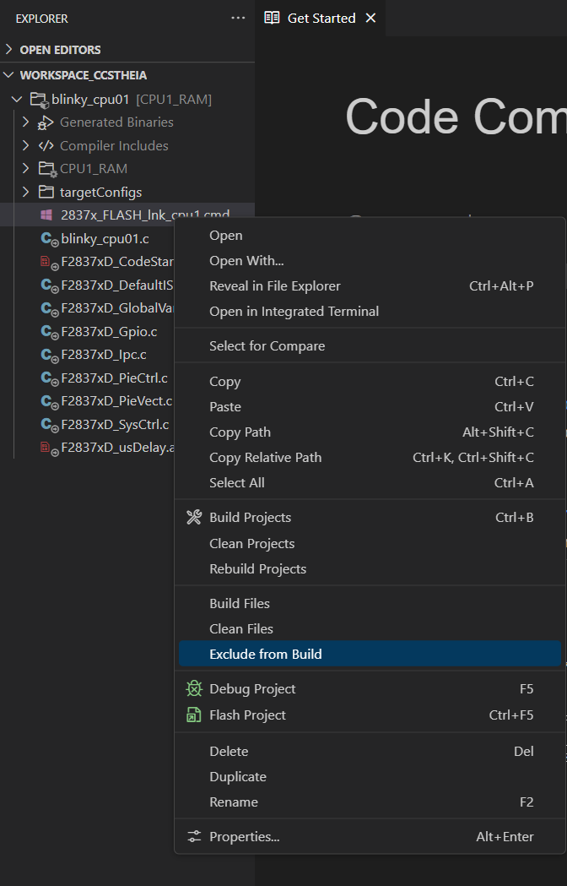

On the upper tab, select `Project` -> `Build Projects`. A console prompt will show at the bottom of the screen indicating the status of the project building. If the project was succesfully built, the following message should show up:

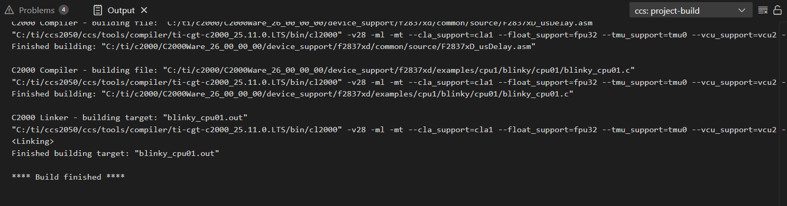

## Running the code on a Debug Session
Once we get the `Build finished` message, we can now run the code and upload it to the board's RAM. Once we plugged in the board to the computer via USB, head to the upper tab and select `Run`:

!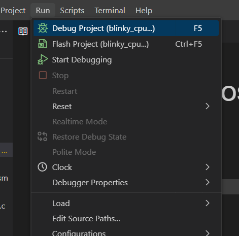

Click on `Debug Project`. A debug session will open up.

The debug manager will prompt to select which CPU Core is to be used. Select C28xx_CPU1 as the core to load the program on:

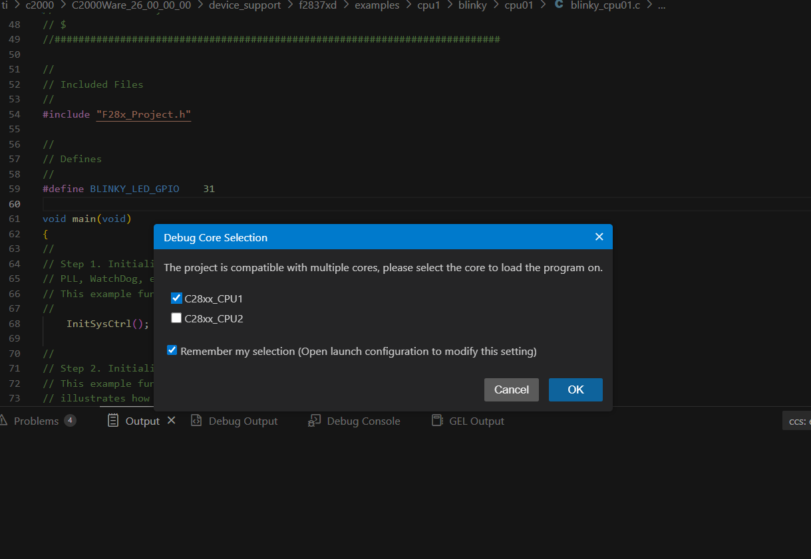

The `blinky_cpu01.c` program will launch on the debug session. To start running, click on `Continue` icon on the debug tab located at the upper left corner:

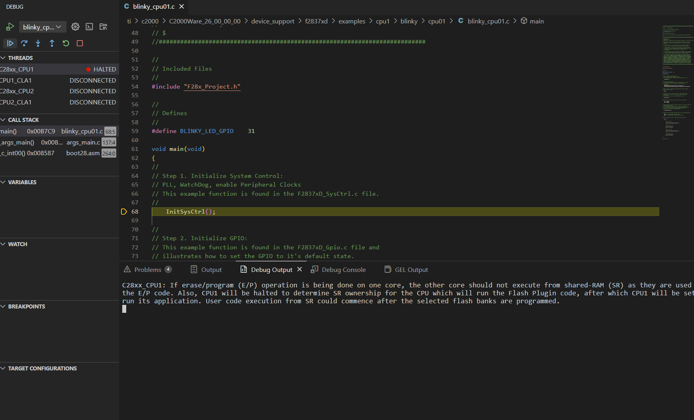

Now the code should start running, and the blue on-board LED is now blinking!

