# Training 01 - Blinky
Once CCS and C2000Ware are set up, the very first project is ready to be done!.
The purpose of this training is to get to know the CCS Workflow, as well as veryfying the set up was done correctly.

C2000Ware is included with some example projects. For this training the "Blinky" project will be used, which is a simple toggle of one of the onboard C2000 LED's.

## 🚀 Launching CCS and opening the Workspace 
First,plug the C2000 board via the USB cable. Then, open Code Composer Studio.
The CCS executable should be in the folder `ti` that was created during the installation of CCS. The full path of the directory is the following:
`/home/user/ti/ccs2031/ccs/theia`
This executable can be run through the terminal, although it'll be more comfortable to access it by creating a shortcut to our desktop.
Head to the `applications` directory using `cd`:
```bash
cd ~/.local/share/applications/
```
Create a new `.desktop` file using the command `touch`:
```bash
touch ccs.desktop
```
Once the file is created, open it (using any text editor), and paste the following template:

```bash
[Desktop Entry]
Version=1.0
Type=Application
Name=Code Composer Studio
Exec=/home/user/ti/ccs2031/ccs/theia/ccstudio
Icon=utilities-terminal
Terminal=false
Categories=Development;IDE;
```
`NOTE: Remember to change "user" to the respective user of the defined path of the computer.`

Now CCS should have a direct access on the desktop so that CCS can be launched by double-clicking it.

## 🛠️ Inside CCS

Once CCS launches, the "Get started" page will be shown:

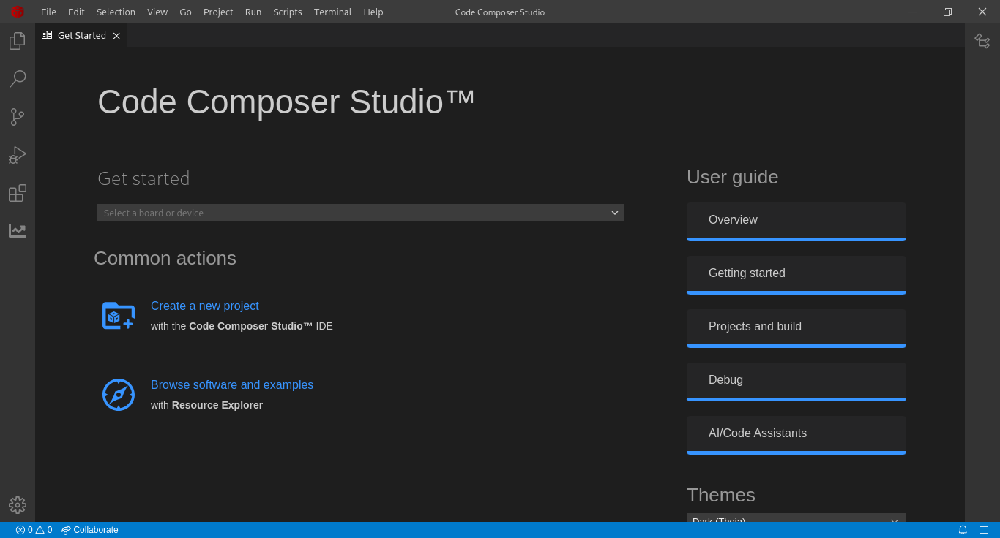

This window can be safely closed. Before uploading this first project to the board, a quick setup of CCS must be done.

### Setting up C2000Ware path on CCS
CCS must know where the C2000Ware path is located so that it can import all the necessary files to build the project. Head to the upper left corner to the `file` tab, then to `Preferences` -> `Code Composer Studio Settings`.

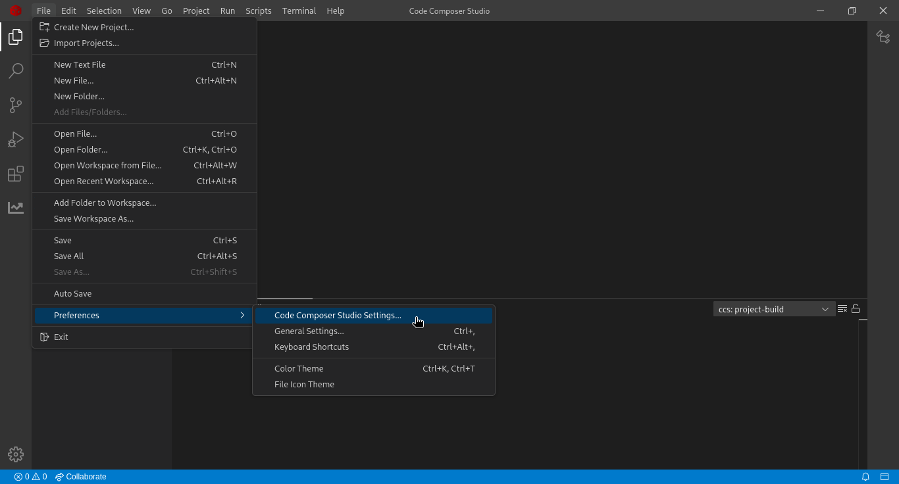

A new window will pop up. Go to the `General` tab, and then to the `products` sub-tab. On the `Product Discovery Path` click on the plus (+), and then browse to the `ti` folder. Inside this folder, open up the `c2000Ware` folder, and then select ` C2000Ware_6_00_01_00`. Now C2000Ware should be listed as a Discovered Product.

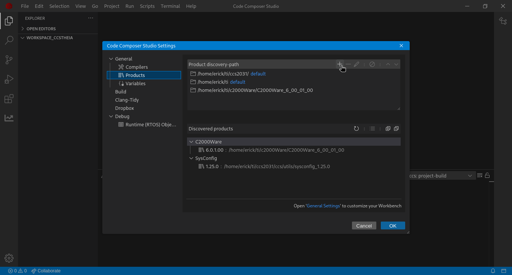

* Should C2000Ware be shown as a Discovered Product before manually selecting the `C2000Ware_6_00_01_00` folder this step can be skipped since CCS already detected the C2000Ware's path.

Close this page by clicking the `"OK"` button.

By default, when CCS is launched the very first a folder is created on the `home` directory named `workspace_ccstheia`. This directory is called the "Workspace". Think of this as a "toolbox" where all the components of the projects are stored and a safe space where they can interact with each other.

## 🛠️ Setting up Blinky_01
On CCS on the left side bar there are some icons (Two paper sheets, a magnifying glass, a branch, a play button with a bug). Click on the two paper sheets to access the explorer tab. Here there are two lists, `Open Editors` and `WORKSPACE_CCSTHEIA`. Click on `WORKSPACE_CCSTHEIA` to expand the list (it should be empty at the moment):


To import the `Blinky` project from C2000Ware to our workspace on CCS on the upper left corner click on `File`, and then on to `Import projects`:

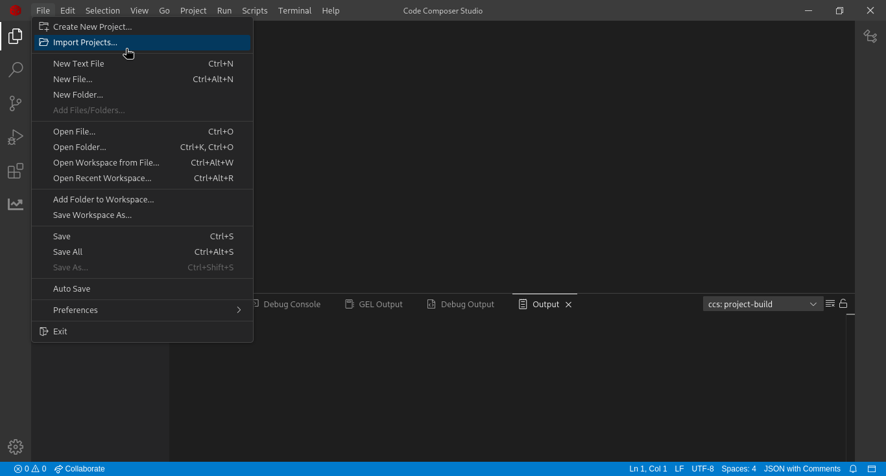

On the following window select the directory from where the project is to be imported from. First, click on the  `"browse"` button:


Browse to the `home` directory, then to the `ti` folder and then open up `c2000ware` -> `C2000Ware_6_00_01_00`. Inside this folder there must be another folder called `device_support`:


Access this folder and select the sub-folder correspondig to the target microcontroller (in this case the C2000 Launchpad belongs to the `F2387XD` family):

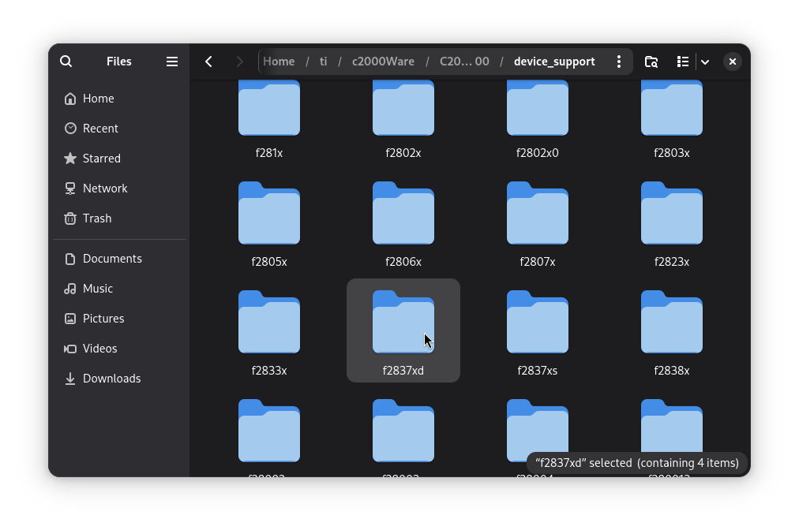

Upon openning this folder, there's an `examples` subfolder:


This folder contains both examples for single core programs (`cpu1`) and dual core programs (`dual`). This training uses the single core version of blinky:

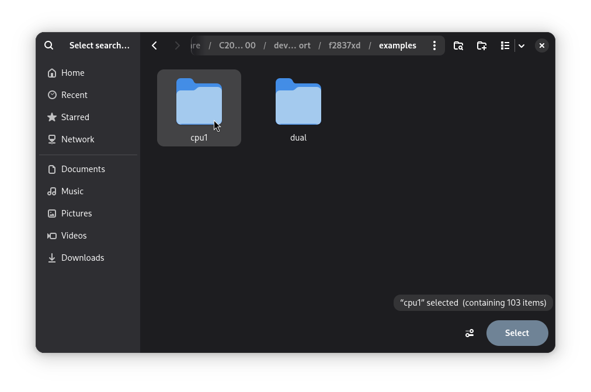

Within this directory `cpu1` are located all the folders for all the single core examples projects. Select the `cpu1` directory to be browsed:


CCS should start importing all the available projects to the project import tool. Look for the `blinky_cpu01` project and select it. Also, on the collapsable list select the "Copy imported projects into" option:


Once the project is done importing all the files related to the project are displayed on the CCS Explorer:


One of the files imported on the project is `TMS320F28377D.ccxml`. This file contains specific information about the core on the Development board. However, the C2000 Launchpad board uses `TMS320F28739D` core. Trying to use the default target configuration for this board is likely to fail.Instead, a custom `.ccxml` file for the board needs to be set up. Left-click on the `TMS320F28377D.ccxml` file and selecte `Delete`

Once `TMS320F28377D.ccxml` is deleted, create a custom `.ccxml` file to debug the project. On the upper bar tool, click on `view`, then `Debug` -> `Target Configurations`:

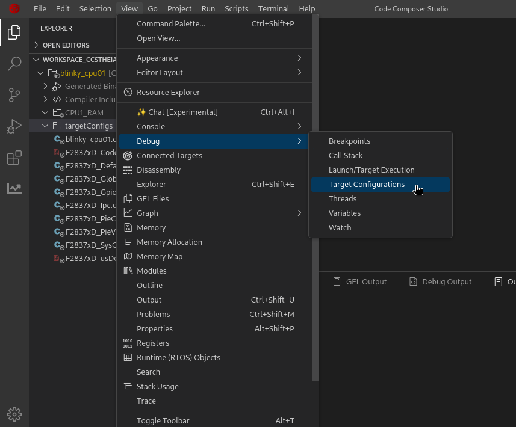

On the next window go to `Target Configurations` and click on the "+" sign (New Target Configuration):

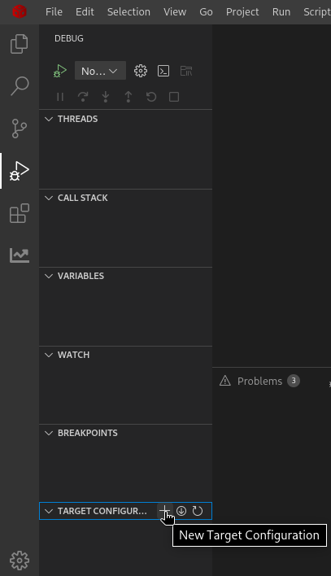


## Creating the Target Configuration
Upon selecting the "+" sign a new window will open prompting to enter the name for the target configuration. Enter the name `F28379D_XDS100v2.ccxml` 

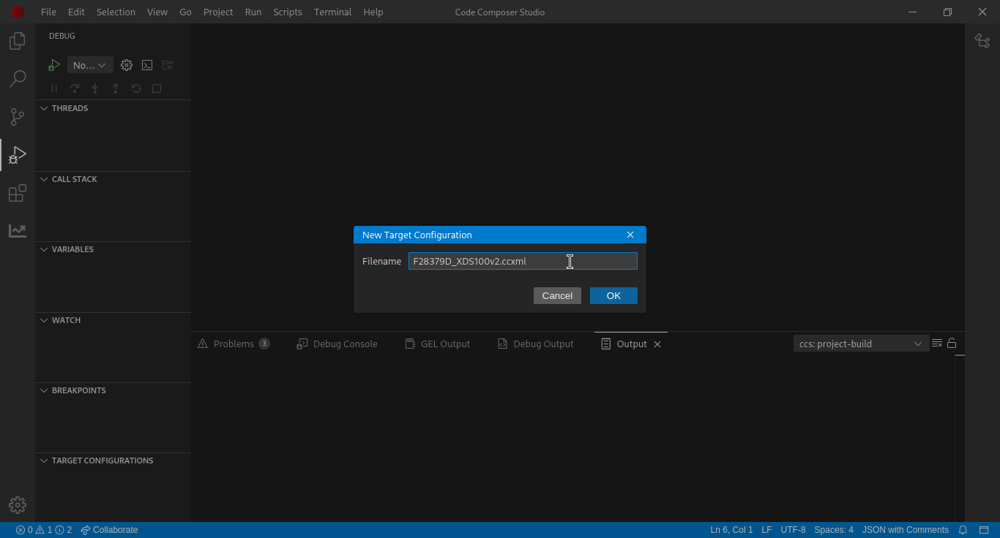

Once the file is created it should be now visible on the "Target Configurations" box. Open this file to launch the following window:

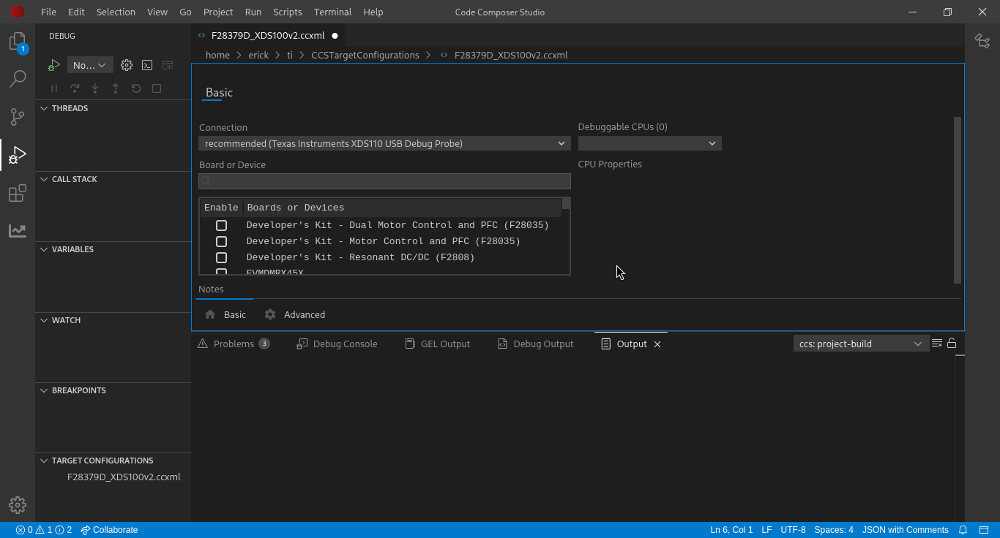

## Tuning our Target Configuration file
The next step is to set up the necessary parameters for the board. On the `Connection` tab look for `Texas Instruments XDS100v2 Debug Probe`. On the `Board or Device` tab select `TMS320F2837F9D`, and on `Debuggable CPUs` select `C28xx_CPU1`. The Target Configuration file should be set up as following:

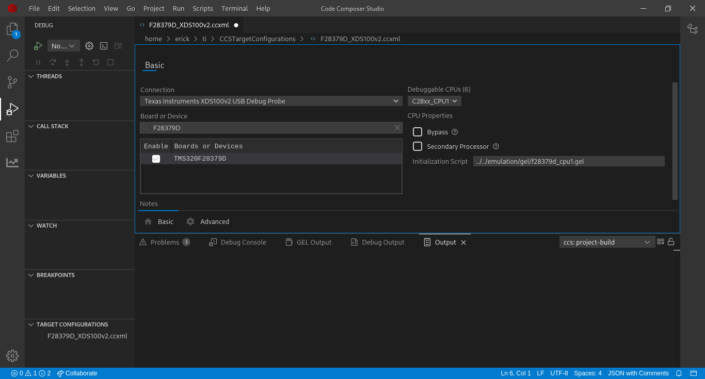

Save this file on the upper tab `File` -> `Save`

## Building our project
Go back to the `Explorer` tab (remember it's the icon with the two paper sheets). On the project, left-click on it and select the `Properties` option:

 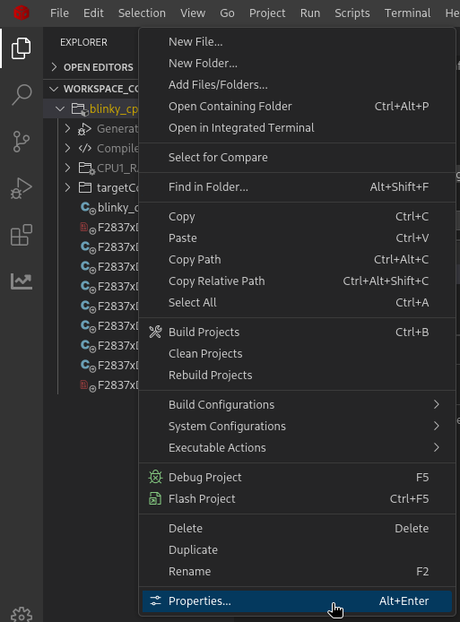

A new window will pop up with the properties for this project. Tune the optins as following:
* Device Family: `C2000`
* Device/Variant Core: `2387xD Delfino` -> `TMS320F28379D` -> `C28xx_CPU1`
* Connection: `Texas Instruments XDS100v2 USB Debug Probe`

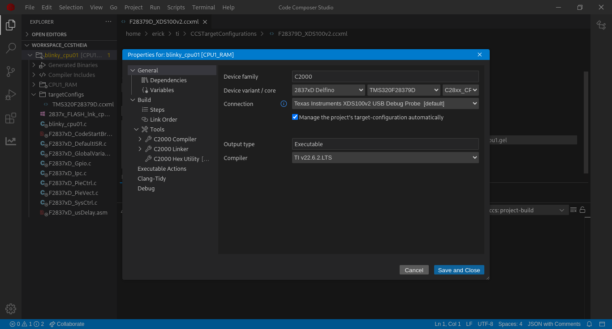

Save and close this window.

⚠️ Important Note: After setting up the Target Configuration File and changing the project properties, CCS will change the files on the workspace. First, the file `TMS320F28379D.ccxml` should now show up as the `targetConfigs` file. Also, a new file `2837x_FLASH_lnk_cpu1.cmd` will appear:

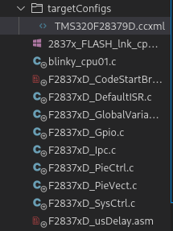

Left click on `F28379D_XDS100v2.ccxml` and make sure the option `Set as Active Target Configuration` is checked.

Also left click on `2837x_FLASH_lnk_cpu1.cmd` and select `Exclude From Build`:

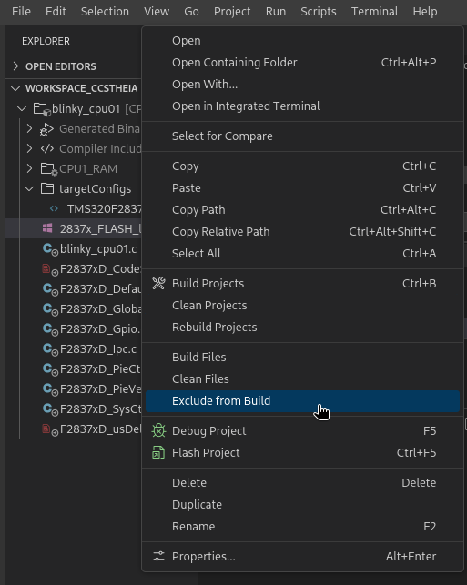

Now the file should be greyed out (this file won't be taken into consideration while building the project)

The next step is to build the project. On this step all the files are linked to create a single `.out` file which is going to be the executable to be uploaded.

Left click on the project `blinky_cpu01`, and then select `Build Projects`:

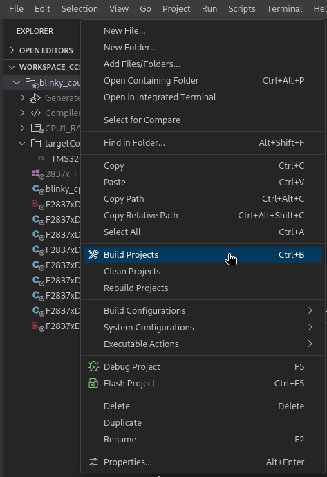

On the lower bar at the `Output` tab a few messages will be shown with the progress of the build. Should all the steps have been followed at this point the following message will display:

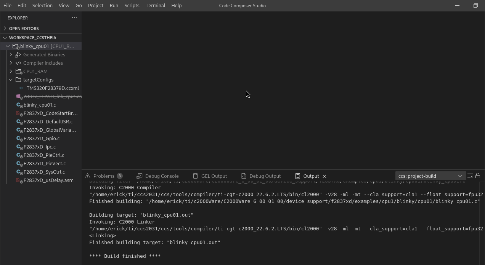

The message `Finished building target: "blinky_cpu01.out"` indicates that the project was succesfully built.

## Executing the project
On the file explorer, left click on the `TMS320F28379D.ccxml` file and select `Start Project-less Debug`:

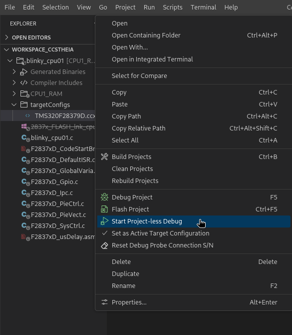

The window will change. Also, the lower bar will turn orange meaning that CCS is running the Debug Mode:

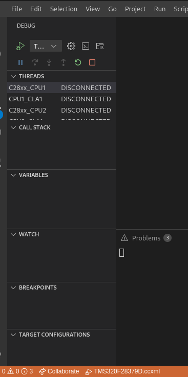

On the `Threads` tab a list of CPUs is shown. Left click on the `C28xx_CPU1` cpu (that should be on a "DISCONNECTED" state) and select `Connect target`:

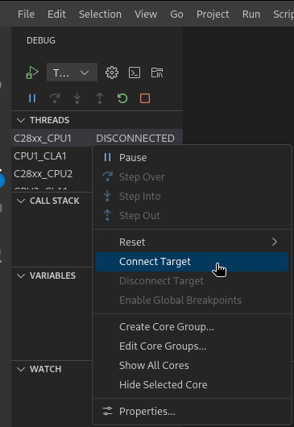

Now the state should change to "HALTED", and the `CALL STACK` tab should be displaying an HEX memory address. A message is also shown on the console:

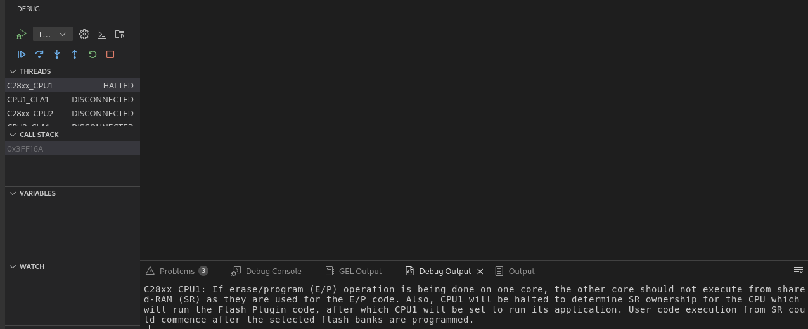

Once the CPU is connected the next step is to upload the `blinky_cpu01.out` file to the board's RAM. On the upper bar, head to `Run` -> `Load` -> `Load Program`:

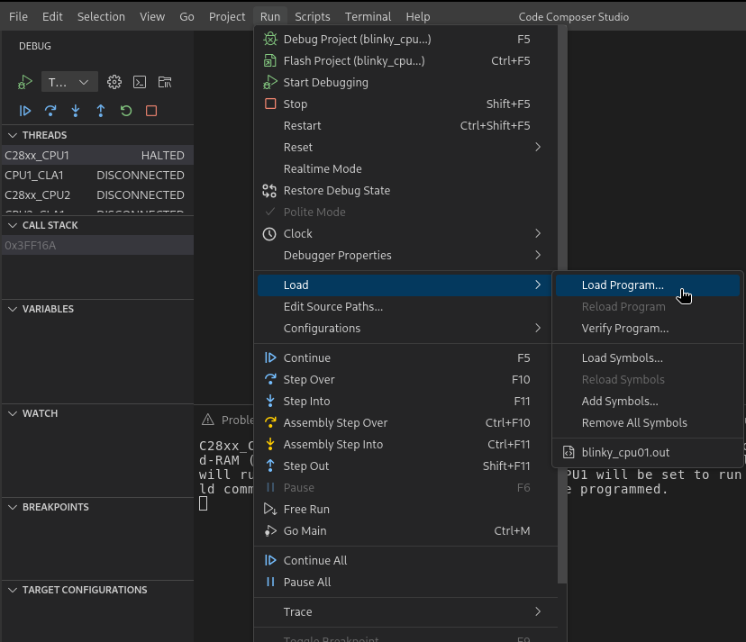

The next window prompts to select the Program to be uploaded. Select `workspace`:

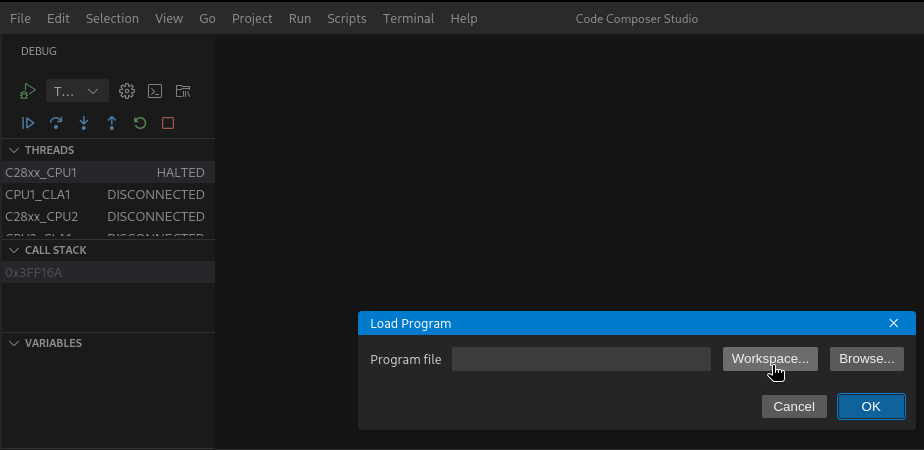

The `blinky_cpu01` folder will be displayed. Expand the folder, as well as the `CPU1_RAM` subfolder. The `blinky_cpu01.out` file should be within this directory:

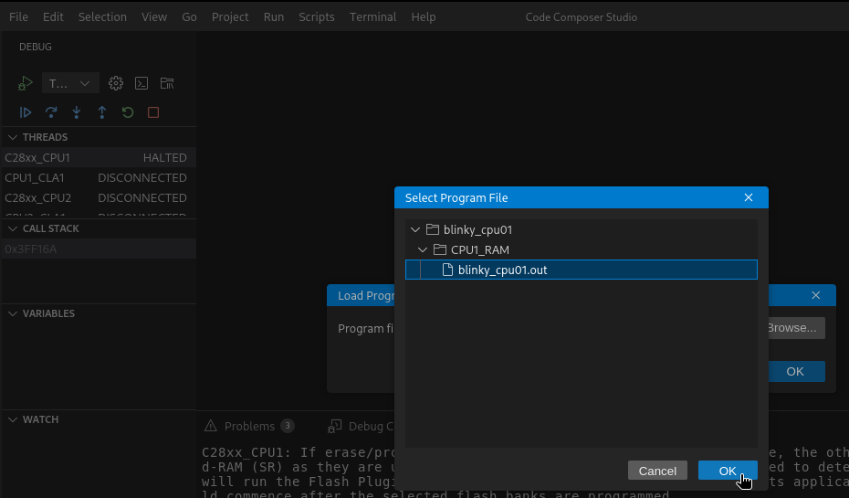

Confirm this is the project to be uploaded. The `THREADS` tab will change, and now `C28xx_CPU1` should be displaying a red dot. Also, the `blinky_cpu01.c` will open up with a highlighted line of code:

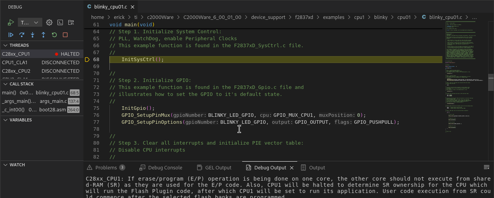

As for now, the CPU is on a standby state waiting for the code to start running. Head to the `Run` tab and select `Continue`:

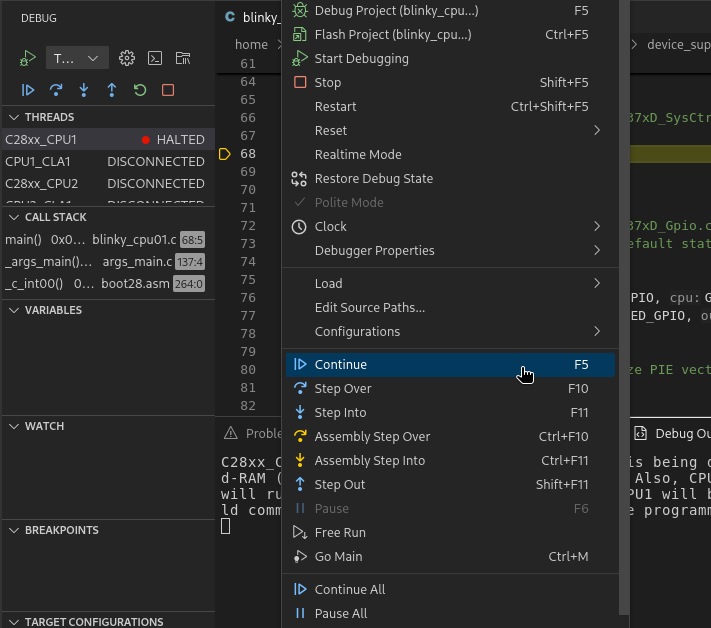

The Blue On-Board LED should start blinking!