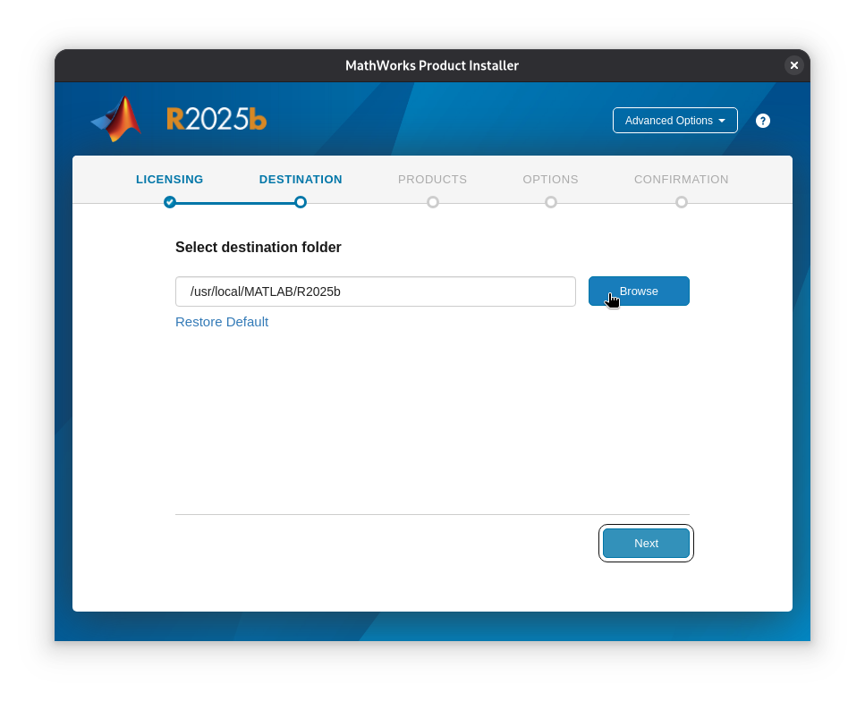
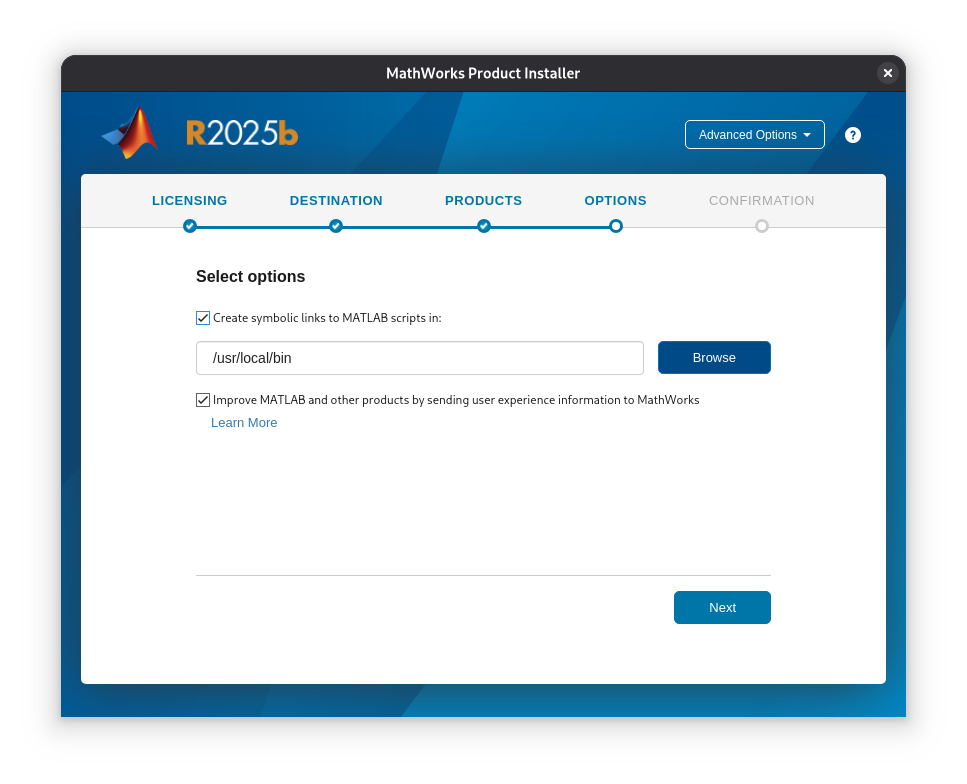
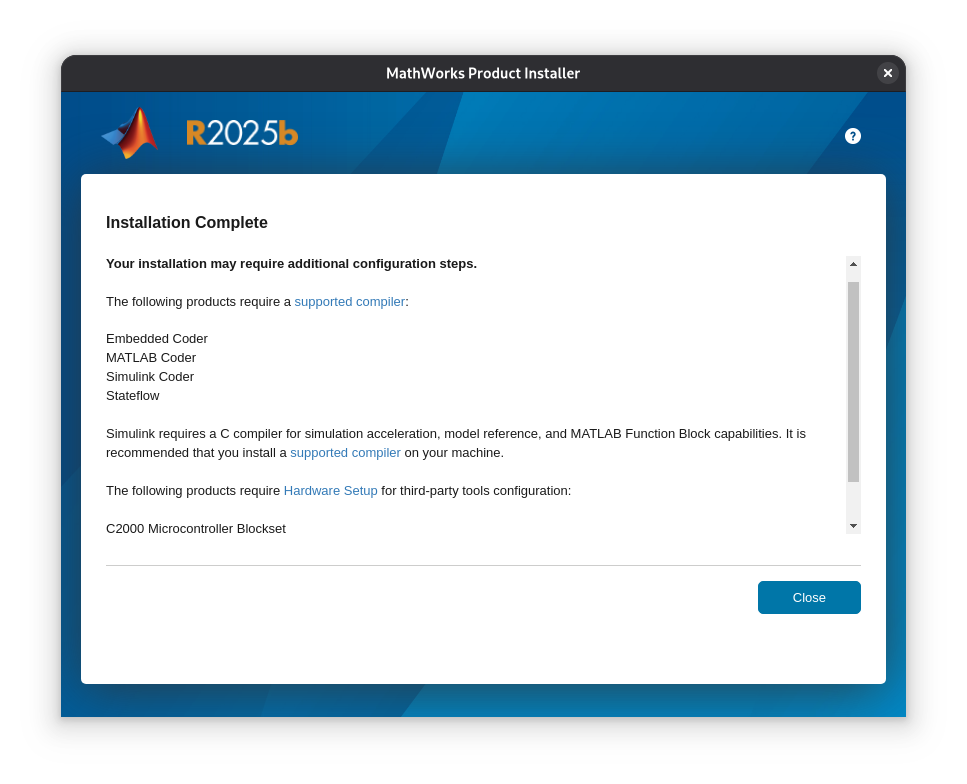
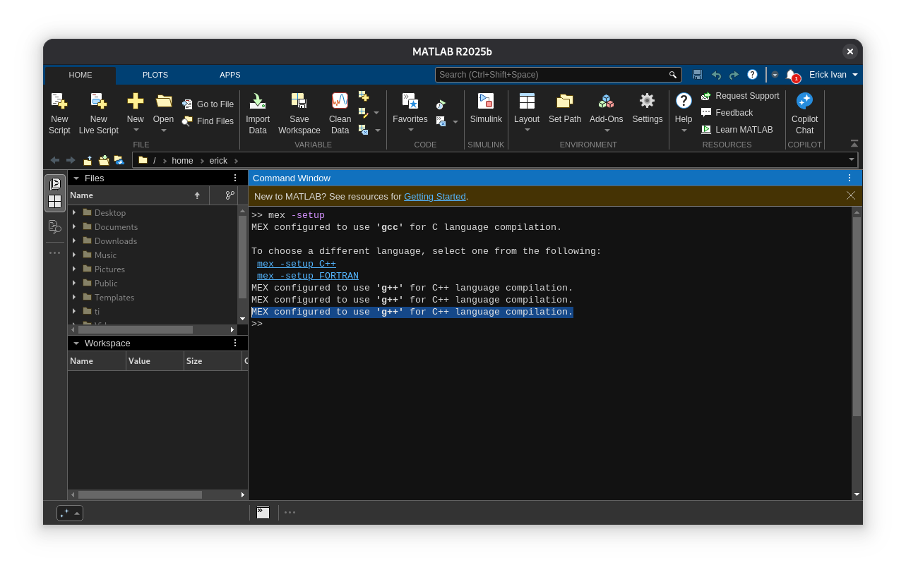
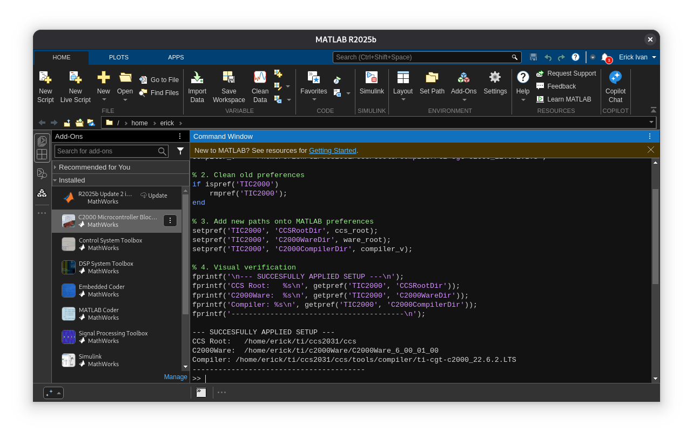
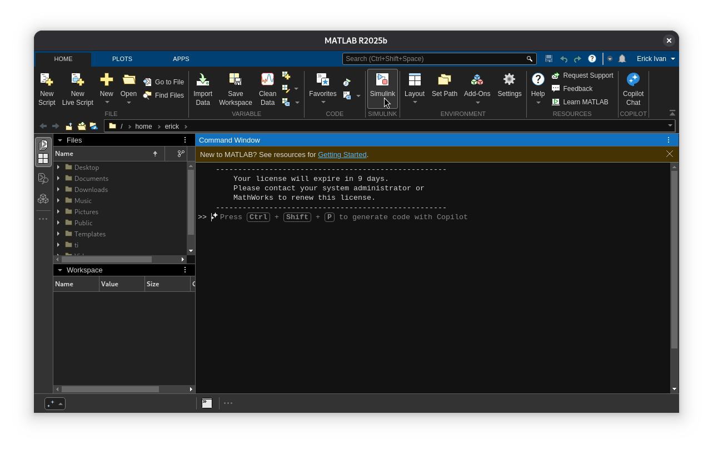
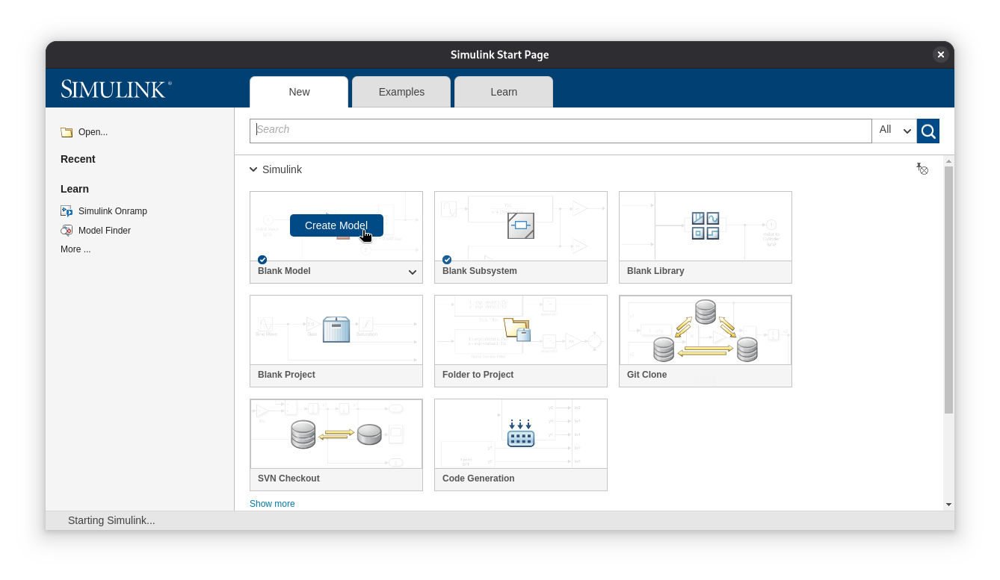

# Setting up Matlab (Linux)

The next step is to run code on a MBD (Model Based Design). Instead of writing actual code to the board, the Model Based Design allows to focusing on the actual model without having to worry about writing code. For this, Matlab implements a toolbox for the C2000 Launchpad board that includes the pheriperals we can use with the board.

## Installing Matlab/Simulink
We'll begin with a clean installation of Matlab/Simulink.

First, download the [Matlab installer](https://la.mathworks.com/downloads/). The downloaded file should be a `.zip` file. Extract this file and open a terminal session on the same directory of the extracted folder.

Run the following commando:

```bash
chmod +x install
```

And then run the executable:

```bash
sudo ./install
```
A window will pop up. Login with the licensed email, and accept terms and conditions.

On `Destination Folder`, select `/usr/local/MATLAB/R2025b`:




On the Select Products window, select the following options:

* MATLAB

* Simulink

* MATLAB Coder

* Simulink Coder

* C2000 Microcontroller Blockset

* Signal Processing Toolbox

* Embedded Coder (Vital para el C2000)

* Optional: Control System Toolbox, DSP System Toolbox

On the options tab, choose `Create symbolic links to Matlab Scripts in`:



On the confirmation tab proceed to install the selected packages. Once installed, the following notice might show up:



Here MATLAB indicates that it's been installed correctly, but some further setup might be needed in order to use the downloaded packages.

## Setting up the Host Compiler
To set up the host compiler, open up a new terminal session and run the following commands:
```bash
sudo apt update
```
and then:
```bash
sudo apt install build-essential g++
```
This will install the `gcc`, `g++` and `make` dependencies in order for MATLAB to work properly.

## Setting up the Linux Hardware Module dependency
The version of Matlab we'll be using was designed to be used with Ubuntu. Since we're using Debian (which is based in Ubuntu but with a few tweaks), we need to setup the Linux Hardware Module dependency to be able to use the C2000 Board Toolbox.

On the terminal session, run the following command:
```bash
sudo apt install lsb-release
```
Once installed, it's time to setup MATLAB.

## MATLAB First launch
We'll launch MATLAB for the very first time. Head to the terminal and enter the following command:
```bash
matlab &
```
Once MATLAB launches it will prompt us to sign in. Use the licensed email to log in.

On the MATLAB Command window (>>) type the following command:

```bash
mex -setup
```
MATLAB will prompt the following on the command window:
```bash
MEX configured to use 'gcc' for C language compilation.

To choose a different language, select one from the following:
 mex -setup C++ 
 mex -setup FORTRAN
 ```

 Select `mex -setup C++`

 Once MATLAB finishes setting up, it'll prompt the following to indicate that the compiler was succesfully set up:

 ```bash
 MEX configured to use 'g++' for C++ language compilation.
 ```
 

 ## Setting up the C2000 Board
Now it's time to link MATLAB to the C2000 Board and CCS tools. First, we need to tell MATLAB where all the tools are located first. 
On our desktop, head to the `home` directory, then to the `ti` folder. (Here we should have the `C2000Ware` and `ccs2031` subfolders).
Copy the direction to the following folders:
- CCS Root: `/home/erick/ti/ccs2031/ccs`
- C2000Ware: `/home/erick/ti/c2000Ware/C2000Ware_6_00_01_00`
- Compiler: `/home/erick/ti/ccs2031/ccs/tools/compiler/ti-cgt-c2000_22.6.2.LTS`

Now on MATLAB, copy and paste the following script:
```bash
% --- Manual Setup Script (User: erick) ---

% 1. Definition of Variables:
ccs_root    = '/home/erick/ti/ccs2031/ccs';
ware_root   = '/home/erick/ti/c2000Ware/C2000Ware_6_00_01_00';
compiler_v  = '/home/erick/ti/ccs2031/ccs/tools/compiler/ti-cgt-c2000_22.6.2.LTS';

% 2. Clean old preferences
if ispref('TIC2000')
    rmpref('TIC2000');
end

% 3. Add new paths onto MATLAB preferences
setpref('TIC2000', 'CCSRootDir', ccs_root);
setpref('TIC2000', 'C2000WareDir', ware_root);
setpref('TIC2000', 'C2000CompilerDir', compiler_v);

% 4. Visual verification
fprintf('\n--- SUCCESFULLY APPLIED SETUP ---\n');
fprintf('CCS Root:   %s\n', getpref('TIC2000', 'CCSRootDir'));
fprintf('C2000Ware:  %s\n', getpref('TIC2000', 'C2000WareDir'));
fprintf('Compiler: %s\n', getpref('TIC2000', 'C2000CompilerDir'));
fprintf('----------------------------------------\n');
```
If the script was succesfully executed and all changes properly applied, MATLAB should display the visual verification to confirm that the Linux path and permissions have been granted:

 

Now, close MATLAB, head to the terminal and enter the following commands:

```bash
sudo chown -R $USER:$USER ~/.matlab
```
```bash
sudo chmod -R 775 ~/.matlab
```

Next, let's open MATLAB again. On the command window, type the following command:

`rehash toolboxcache`


## Creating the Simulink Test model
Now it's time to create our first Simulink model. On MATLAB, head to the upper tab and select `Simulink`:

 

 The Simulink start page should launch. Select `Blank model`:

  


