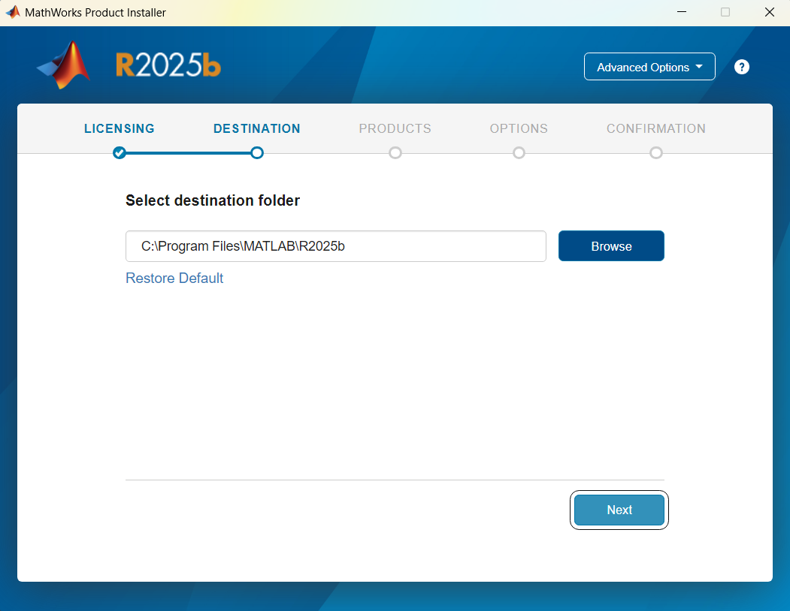
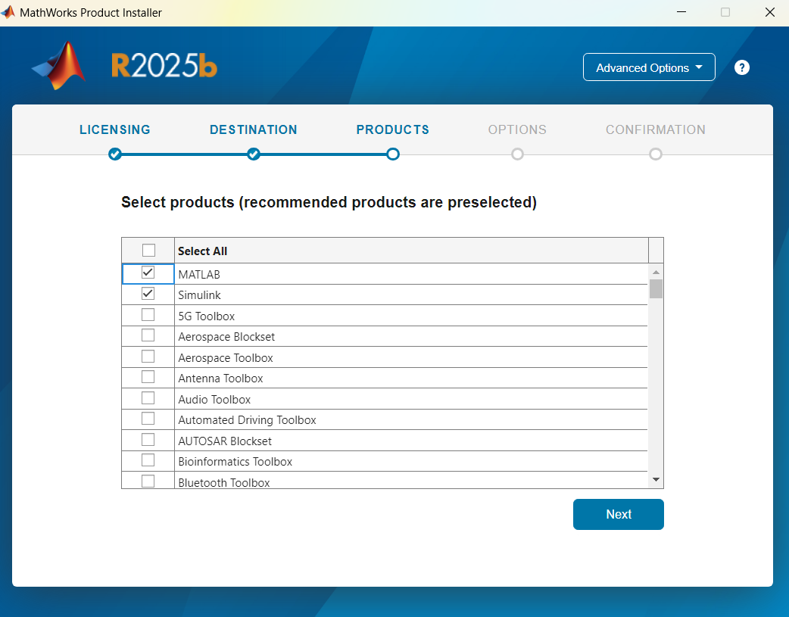
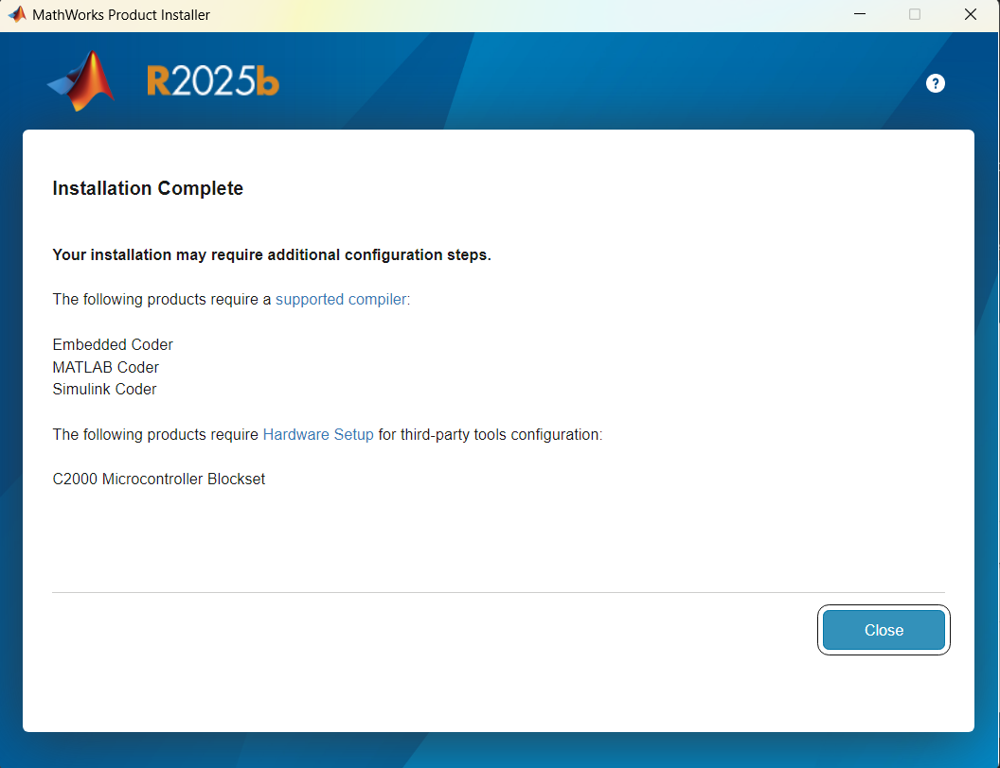
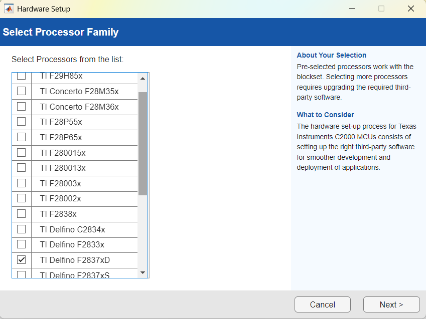
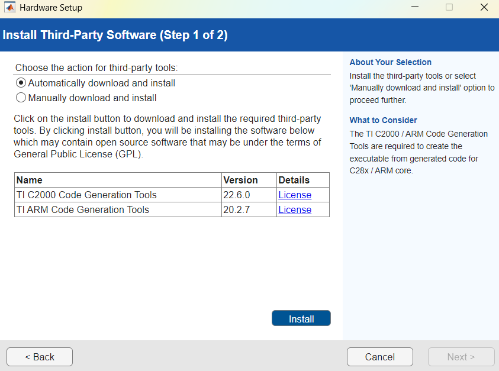
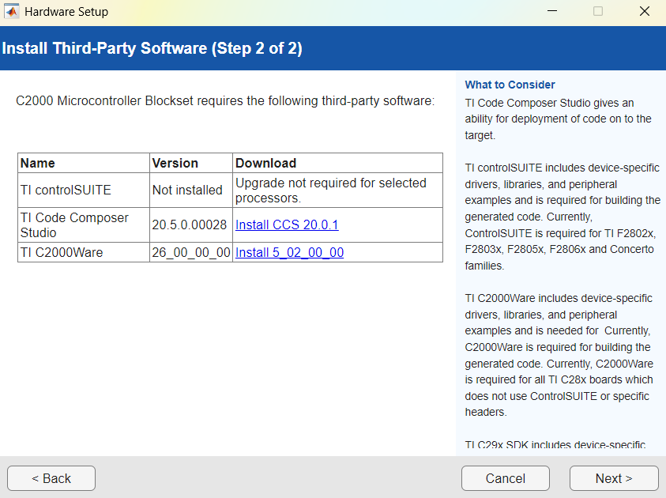
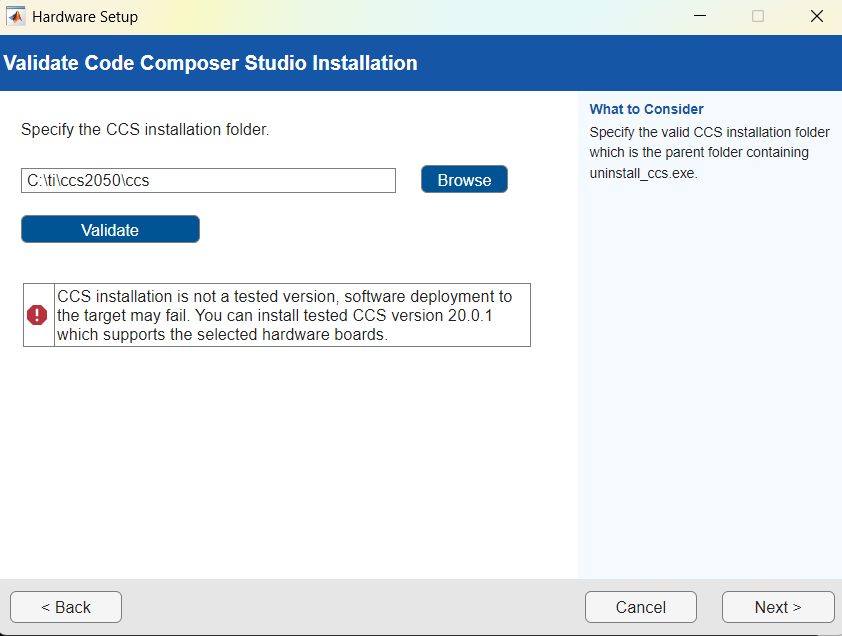
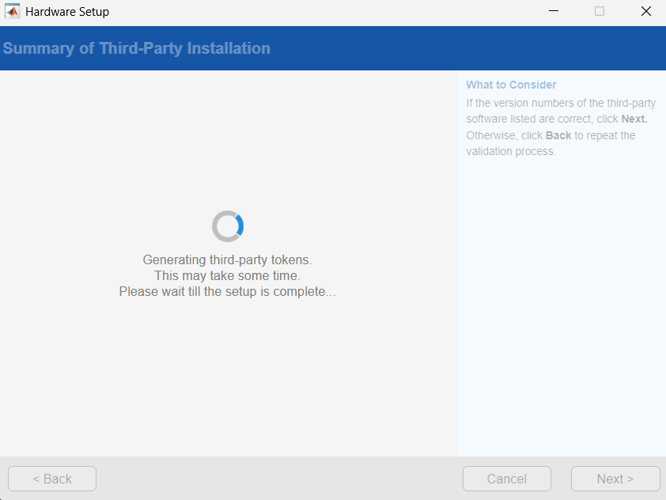
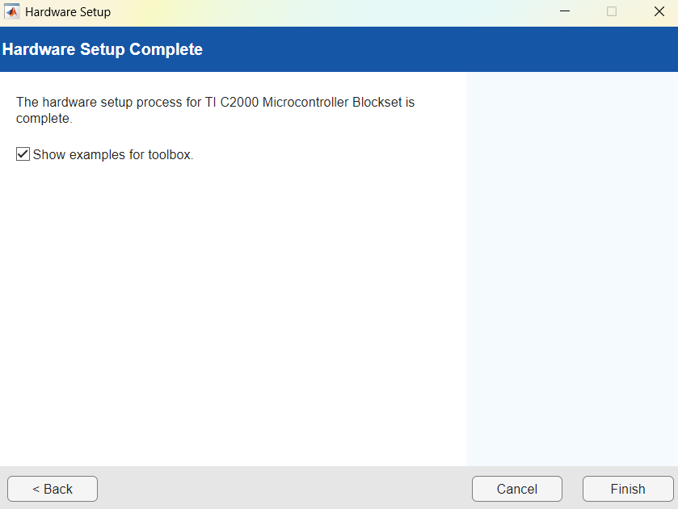

# Setting up Matlab

The next step is to run code on a MBD (Model Based Design). Instead of writing actual code to the board, the Model Based Design allows to focusing on the actual model without having to worry about writing code. For this, Matlab implements a toolbox for the C2000 Launchpad board that includes the pheriperals we can use with the board.

## Installing Matlab/Simulink
We'll begin with a clean installation of Matlab/Simulink.

First, download the [Matlab installer](https://la.mathworks.com/downloads/). Open the executable, and login with your Mathworks account, the accept the Terms and Conditions. Leave the installation destination as default:

On the Select Products window, select the following options:

* MATLAB

* Simulink

* C2000 Microcontroller Blockset

* Embedded Coder (Vital for the C2000 Board)

* MATLAB Coder

* Signal Processing Toolbox

* Simulink Coder

* Optional: Control System Toolbox, DSP System Toolbox

Continue with the installation as required. Since we chose some components, it might take a while to complete. After the installer is done, the following notice will show:

Here MATLAB indicates that it's been installed correctly, but some further setup might be needed in order to use the downloaded packages.

## MATLAB First launch
We'll launch MATLAB for the very first time. Since this is the first time we launch the program, Matlal will require us to log in with our Mathworks account. Once we logged in, Matlab will take us to the main window and the command window will be displaying.

 ## Setting up the C2000 Board
Now it's time to link MATLAB to the C2000 Board and CCS tools. Matlab has already a detailed guide on [how to setup the C2000 Development Boards](https://www.mathworks.com/help/releases/R2025b/ti-c2000/ug/install-support-for-c2000-processors.html). We will follow this guide step by step:

First, on the command window type the command `c200setup` and press enter.

A new window will pop up prompting to select the Processor Family. Since we will be working only with the `Deflino F2387xD` processor we will leave this as the single option checked:

Now Matlab will ask for a Third Party Software Installation. Select "Automatically Download and Install":

Wait for the software to be installed. Once the installation has been confirmed, click next. Now, Matlab requires us to install CCS and C2000Ware. Since we already covered this step previously, we can continue to the next step.

Matlab should already detect the CCS installation path automatically:

Same as with C2000Ware, Matlab should automatically detect the installation path. Continue and wait for the installer to finish until we get the Hardware Setup Complete confirmation:

Once we get the Hardware Setup Complete window, we can finish the installation. Now we can go ahead to experimenting with the [Blinky on a MBD design](./05-BlinkySimulink.md)

