# Setting up Simulink
Uisng a Model-Based Design, we'll execute the Blinky project. Instead of writing code, we'll build the circuit using Simulink blocks.

## Starting Simulink
Open Matlab. On the startup window we'll be greeted with the command window. On the upper tab at the top click on the `Simulink` icon:

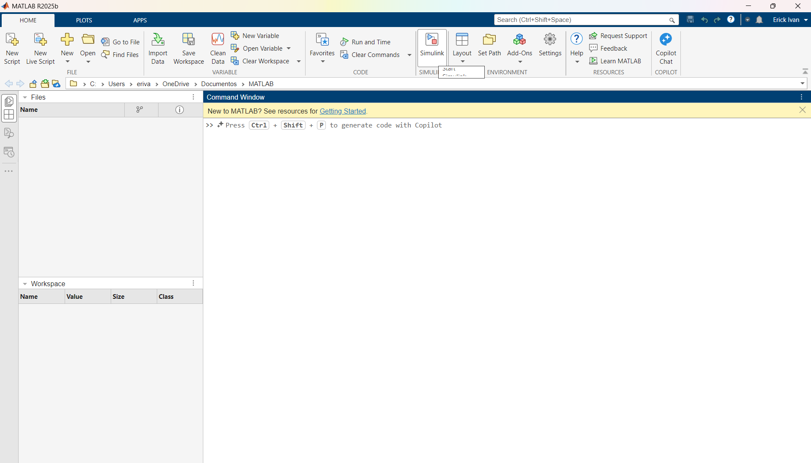

Once Simulink launches, select `blank model`:

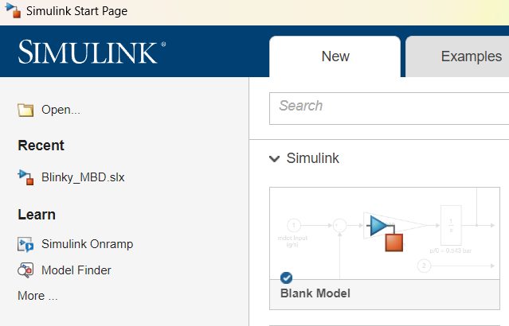

Once Simulink launches, head to the upper tab and select the `Modeling` section. Here, click on the `Model Settings` icon:

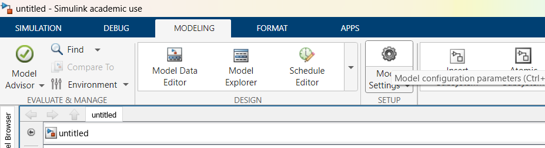

On the following menu, go to the `Hardware Implementation` tab and select the required board. All fields should auto fill:

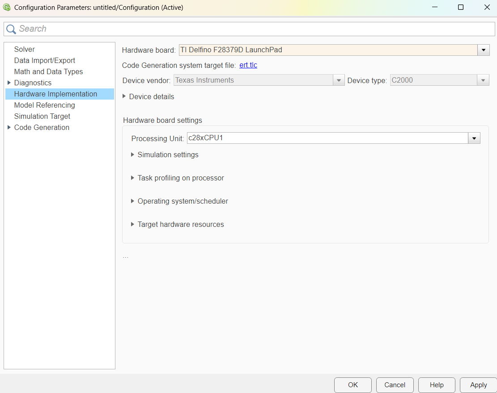

Click on `Apply`, and then on `OK`.

## Blinky on Simulink using a MBD approach

On Simulink, head back to the `Simulation` tab and click on the `Library Browser`:

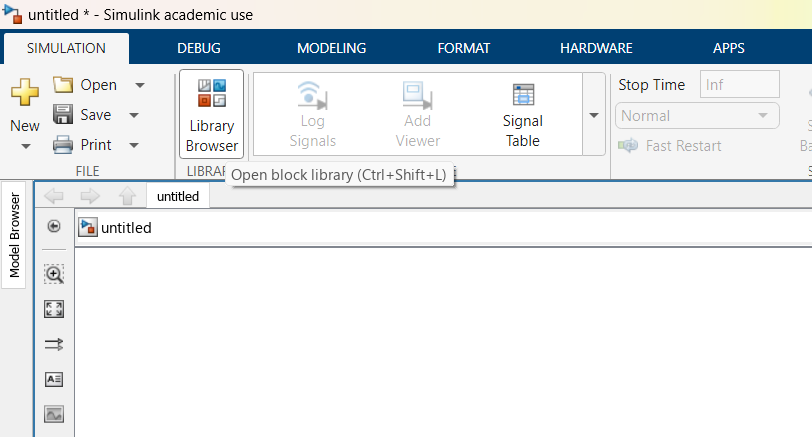

On the Library Browser Search bar, type `pulse`, and drag the `pulse generator` block to the model:

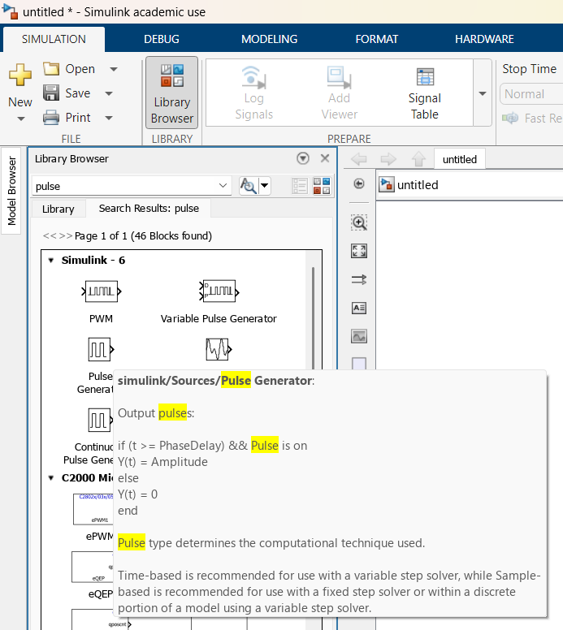

On a similar way, search for `scope` and drag the `scope` block to the model:

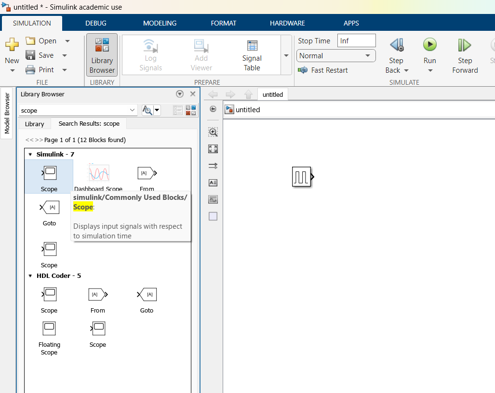

Connect the output of the pulse generator to the input of the scope:

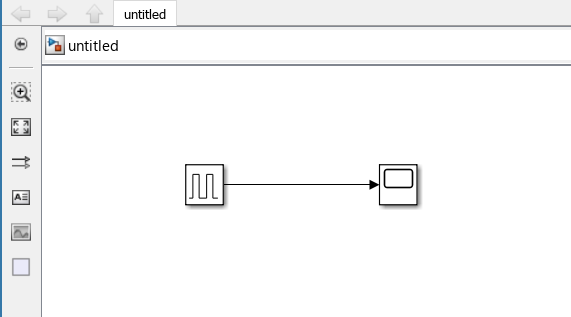

Double click on the Pulse Generator block, and set it up with the following parameters:

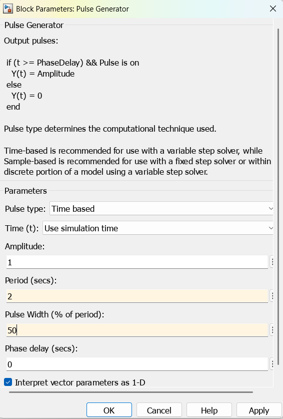

Click on `Apply` and then `OK`.

On Simulink head to the upper tab and click on `Run`:

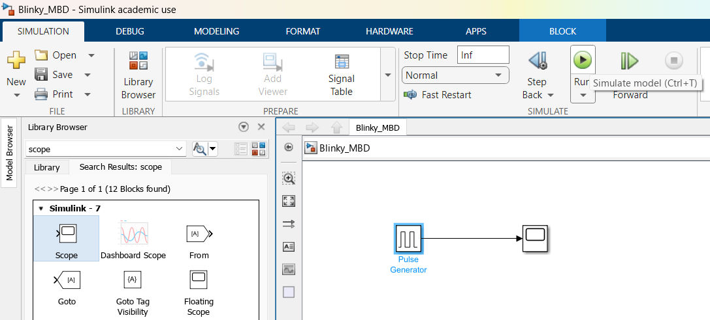

Now that the model is running, double click on the scope. We should see a square signal with an amplitude of one which transitions from low to high every 1 second:

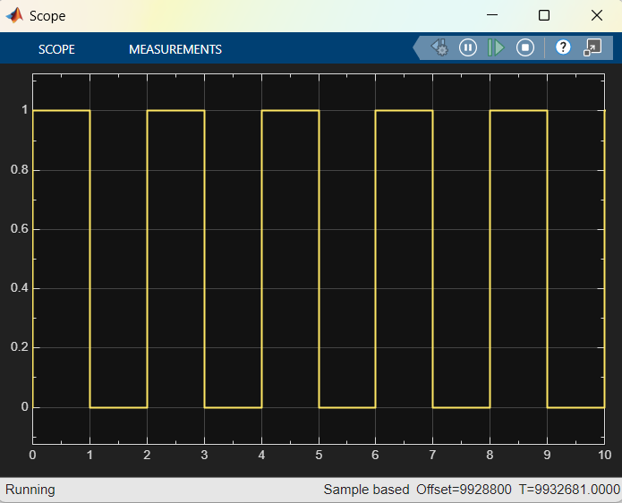

We'll use this train of pulses so that the board flashes the on board LED at the same speed (Every second the LED will turn on and off).

Head back to the Simulink Model, and once again open the `Library Browser`. Expand the `C2000 Microcontroller blockset` list:

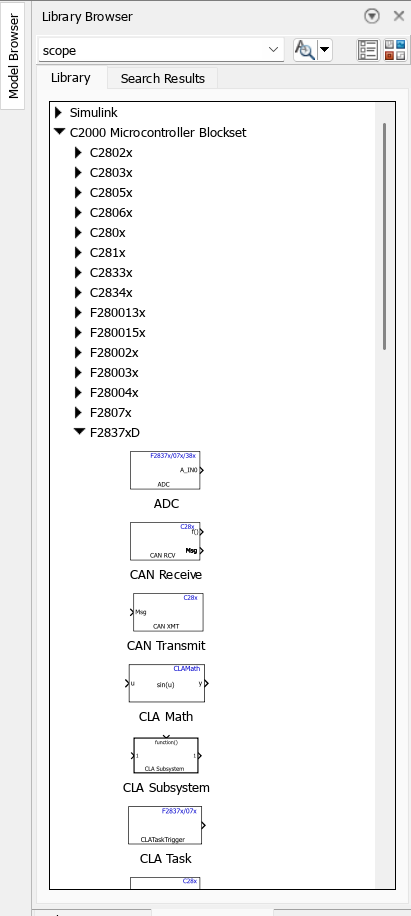

In our case head to the `F2387xD` family and drag the `Digital Output` block:

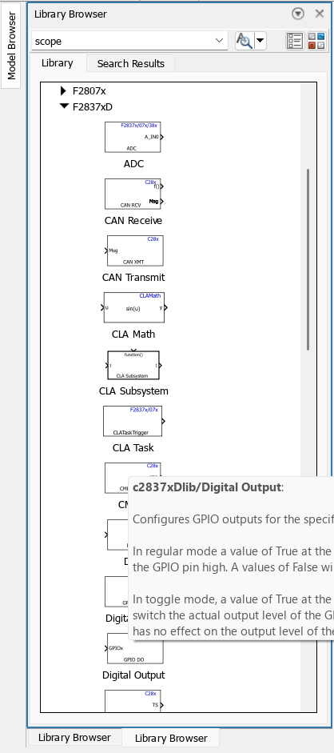

Connect the input of this block to the output of the `Pulse Generator` block:

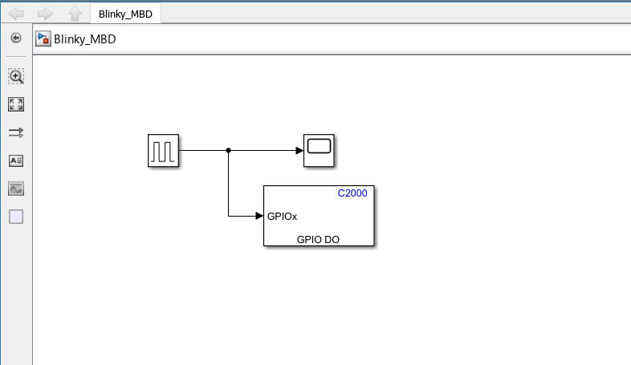

Double click on the `Digital Output` block and set the parameters as following:

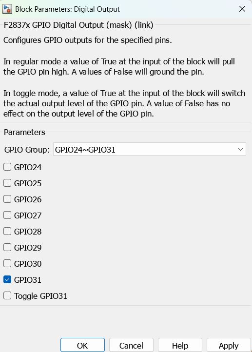

Now, connect the board via the USB cable. On Simulink, head to the `Hardware` tab and select `Build, Deploy & Start`. This will convert the Simulink Model into actual code to be uploaded to the board.

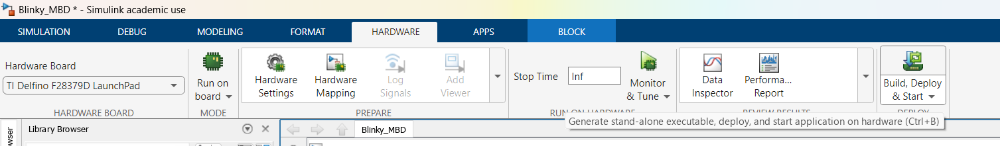

Wait for the process to finish. Once the project has been succesfully uploaded, the On board LED should start blinking!

With this section we got familiar with a new approach on how we can implement code to the board without actually coding. We just need to understand how the system works, set our inputs/outputs and set parameters. This will come in handy later on when we get to desing our control systems, We won't have to worry about hard-coding the system and only understanding how the hardware interacts so that we can set up our blocks on Simulink.

Now that we understand how we can use the board to display an output, we can use the board to [read an input](./06-GPIOAsInput.md)

