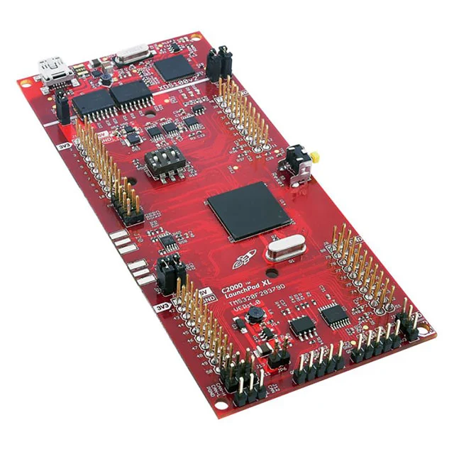
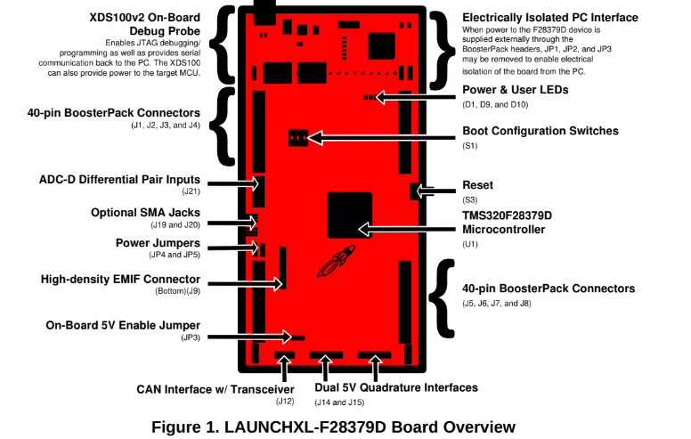

# Designing the PowerShield
## 🛠️ Why a shield?
The Take Home Labs projects are meant to be an educational resource which simplifies the design and implementation of different projects under a "Plug-And-Play" concept. Instead of building every circuit on to a breadboard, a custom Printed Circuit Board (PCB) is to be designed and then plugged to the main board so that the final user only has to worry about adjusting parameters and actually experimenting with the labs. All the nuances about the electronic design of the projects will already be taken care of to offer a more "user friendly" experience.

## 🛠️ About the Shield
The purpose of the PowerShield is to be the foundation of the projects to be implemented with the C2000 board. The main functions of the PowerShield are:
- Provide expansion ports to all of the board's headers for easier and quicker connections.
- Integrate power electronics to provide a wider range of power sources and voltages. The C2000 board works with 3.3V, but some projects might require additonal drivers that work with higher voltages such as 5V and 12V.
- Provide electrical isolation and signal aconditioning for safer handling.

The PowerShield is meant to be plugged and sit "on-top" of the C2000 board.

## 🛠️ Understanding the C2000 Board Layout
To better understand the PowerShield design, let's take a look at the development board layout:

From the Launchpad User's Guide the following layout is provided:

### XDS100v2 Debug Probe
At the very top of the board we'll have a Mini USB Connector along 3 jumpers labelled JP1, JP2, and JP3, along a chip labelled XDS100v2
