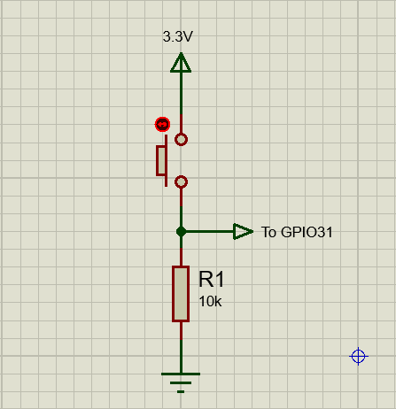
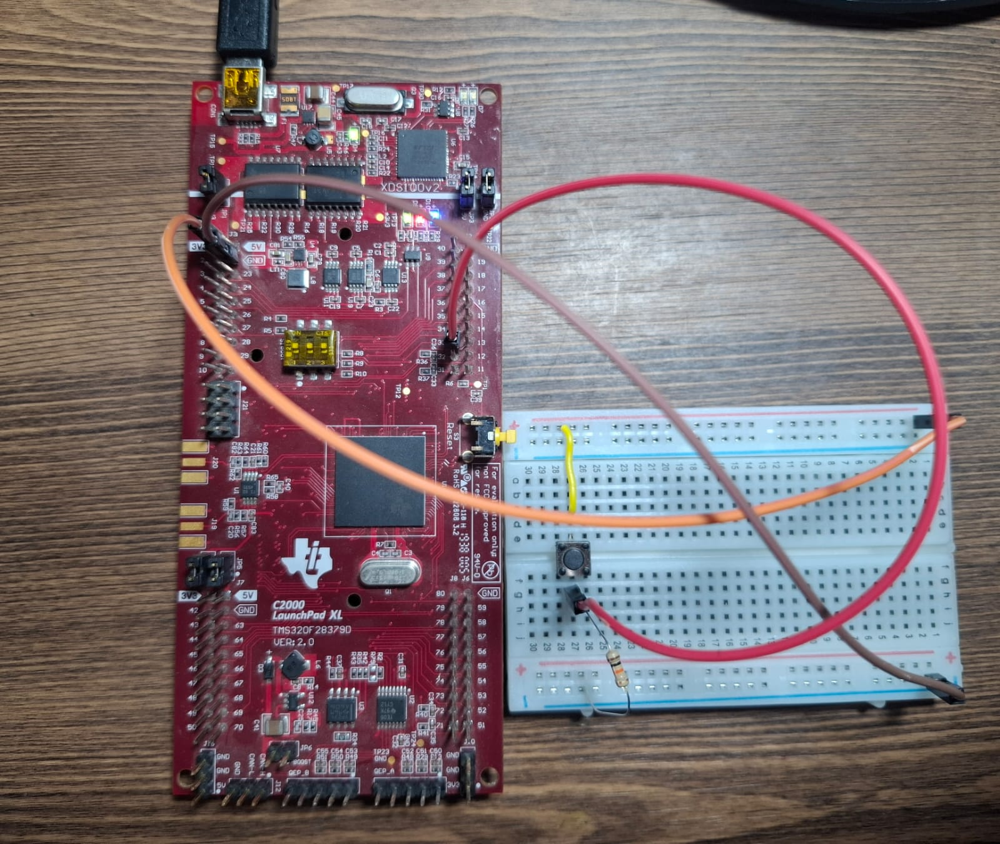
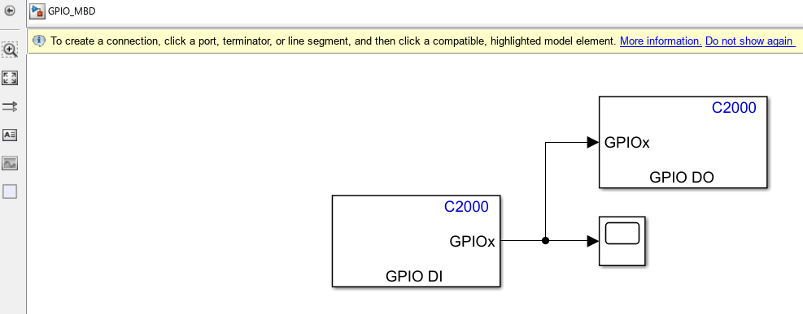
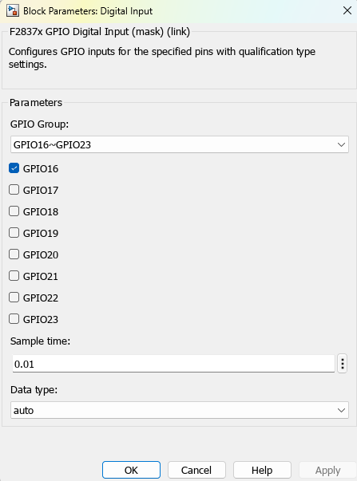
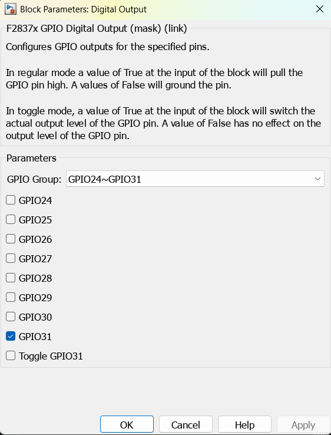
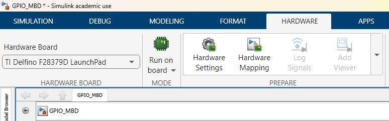
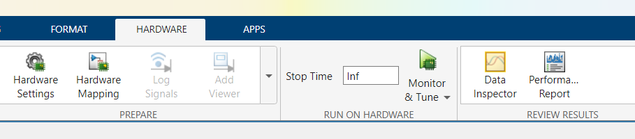
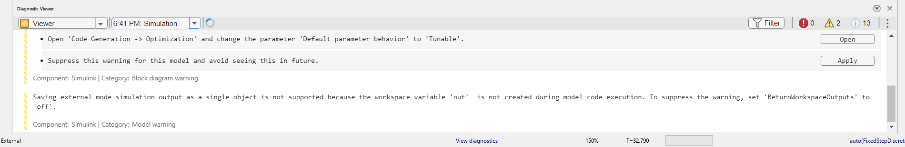
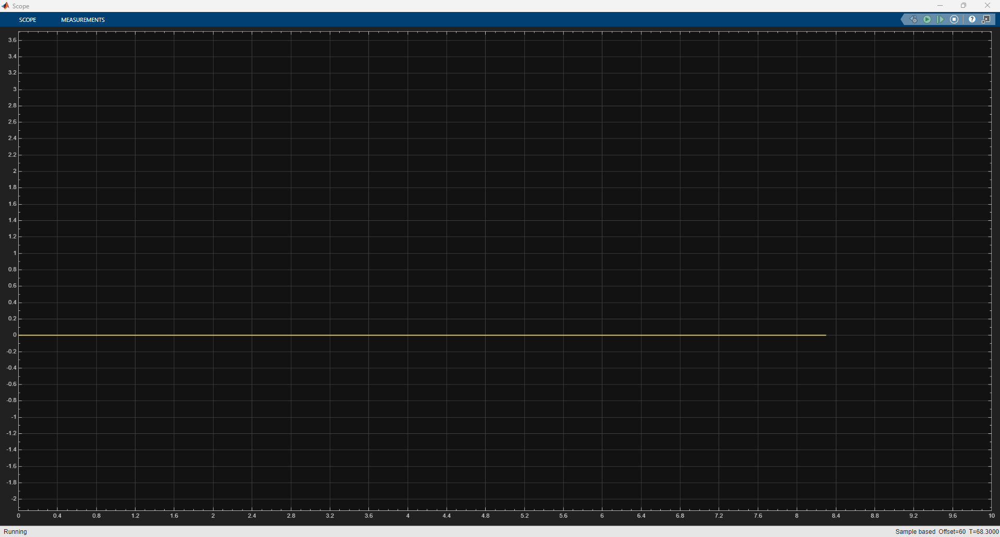
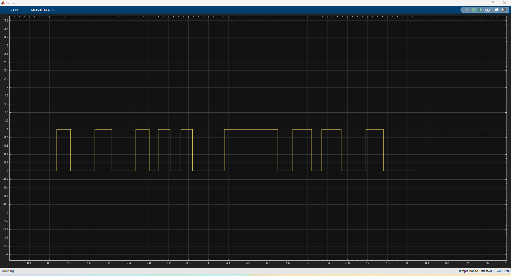

# GPIO on a MBD Design
On the previous section, we set up Simulink to program Blinky and upload it to the board without having to write code. Instead, we built the model of the system using a Clock Source and a GPIO block to get the blue on-board LED blinking.

Now that we learned to display an output to the board, in this section we'll learn to do the opposite. Instead of setting up the model to display an output on the board, we'll set it up to read an input and display it on the model.

## Setting up the hardware
We need to set up the following components on a breadboard to build a basic Button Pull-Down Circuit:
* 10 Kilohms resistor
* Push Button
* Three Dupont Female to Male jumper wires

On breadboard, the circuit is the following:

- Orange Jumper corresponds to 3.3V
- Red Jumper corresponds to the connection to the GPIO 16 (Jumper 4, PIN 33)
- Brown Jumper corresponds to GROUND

## Building the model
Head to Matlab, an create a new blank model.
On the model, add a `Digital Input` block, a `Digital Output` block, as well as a `Scope` block. Connect them as following:

Double Click on the `GPIO DI` block and set the parameters as shown:

Now, double click on the `GPIO DO`block and set it as following:

Like the previous project, set up the model to be used with the corresponding board on the `Hardware Settings` tab:

Now, plug in the board to the computer. On the upper toolbar of Simulink on the `Hardware` tab make sure that the `Stop Time` parameter is set to `Inf`. Select `Monitor and Tune`:

Wait for the model to be compiled and uploaded to the board. The project should be running on `External` mode:

Now, double click on the `Scope` block. We should see a flat line with a value of 0 over the current time:

Now, if we press the button, the scope reflects the change in real time:

Also, the Blue On-Board LED will turn of every time we press the button (here the logic is inverted. If the button is not being pressed, the LED stays on. When the button is pressed, the LED turns off).

Now we have a working model that both reads a digital input and shows it both on the scope (so that we can display a change on an input in real time), as well as changing the state of an output (useful to show the user the change physically happening).

